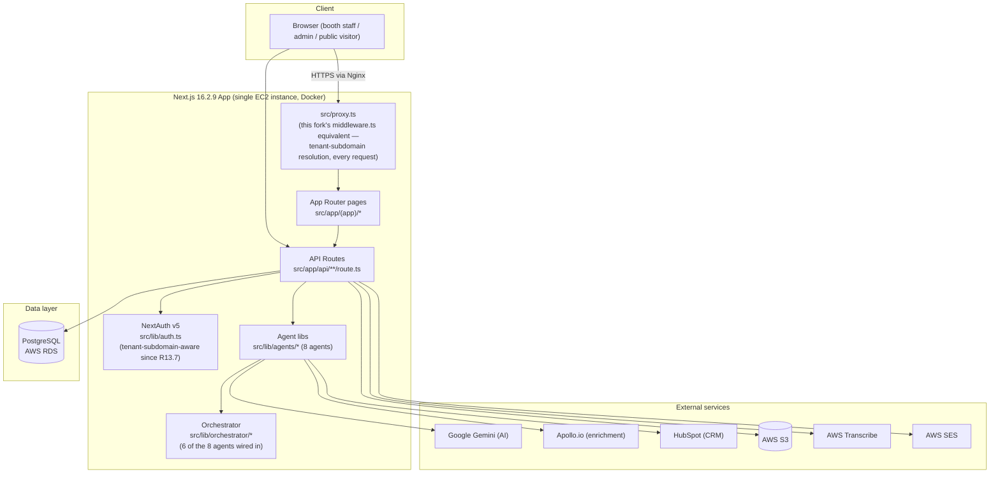

# Trade Show Revenue Agent — Project Handoff

> **START HERE** — This file contains the current operational state of the Trade Show Revenue Agent. Read this before modifying code. Then read [`/docs/README.md`](docs/README.md) for depth on any specific topic. Do not rely on any prior chat conversation — this document and the code are the source of truth. Originally compiled 2026-08-18 by direct inspection of the repository, git history, and (where accessible) production; **updated same day, twice** — once after `main` and `claude/priceless-keller-10439f` were reconciled via merge, and again after that reconciled code (plus a doc-fix commit) was deployed to production and verified live. See [§ Validation & Contradictions Resolved](#validation--contradictions-resolved) for the full history of what was found wrong and fixed.

## `main`, `claude/priceless-keller-10439f`, and production are now all in sync

Both the branch-divergence problem (a separate branch had 16 commits `main` never got) and the resulting production lag (production was running code from before those two branches were reconciled) are resolved as of this update. Production is confirmed, via live SSH and a full functional smoke test, running commit `864f848` — the same commit both `main` and `claude/priceless-keller-10439f` point to. One nuance worth knowing before you assume "everything was broken and now it's fixed": see [CURRENT-KNOWN-ISSUES.md](docs/CURRENT-KNOWN-ISSUES.md) #1 for a correction found during verification — the actual live impact of the credential bug was smaller than first assessed, because a static AWS key already in production kept things working under the old code too. The deploy was still correct and necessary; it just wasn't rescuing an active outage the way it first looked.

---

## 1. Product Summary

Trade Show Revenue Agent is a multi-tenant SaaS for trade-show exhibitors. Booth staff capture leads on the show floor (manually, via QR badge scan, or by photographing a business card), and a chain of AI agents handles enrichment, scoring, follow-up drafting, CRM sync, and ROI reporting — with every revenue-critical number computed deterministically, AI never inventing a figure. Full identity/access management (invitations, password reset, lockout, per-user event scoping) as of Release 13.6, and as of Release 13.8, tenants can now be onboarded via a self-service request → platform-admin approval → automatic provisioning flow, instead of only manual setup.

Capabilities: lead capture (4 entry points) → conversation intelligence (Gemini) → Apollo enrichment → deterministic lead scoring → follow-up draft generation → HubSpot CRM sync (prepare → human approval → sync) → opportunity/pipeline tracking → event ROI analytics with AI executive summary → full IAM → tenant self-registration.

**What it is not (yet):** a system that sends anything to a lead automatically, a system where AI sets a financial number, or a system configured for any industry other than logistics/supply-chain by default (see [Release 14](#19-release-14--configurable-icp) — this is the next planned change).

## 2. Current Production State

| | |
|---|---|
| **Production URL** | https://tradeshow-agent.gtmtechsol.ai — confirmed reachable and functionally verified this session (full authenticated smoke test performed: login, dashboard, lead detail, business-card upload, voice-note upload, all working) |
| **AWS region** | eu-central-1 |
| **EC2 instance** | `i-0ddfdeaef544e8bdd` (Elastic IP `3.73.2.52`), t3.small, Amazon Linux 2023, 2GB RAM + 2GB swap |
| **RDS** | `tradeshow-agent-prod.cnec08ekae5z.eu-central-1.rds.amazonaws.com`, PostgreSQL 16, `db.t4g.micro`, single-AZ, 1-day backup retention (Free Tier cap) |
| **S3** | One bucket, three prefixes (`voice-notes/`, `business-cards/`, `avatars/`) — see [10-aws-infrastructure.md](docs/10-aws-infrastructure.md). **Upload flow verified end-to-end live this session** (real authenticated API calls, real S3 PUT, confirmed visible in UI, then cleaned up). |
| **SES** | Sandbox mode — only `info@gtmtechsol.com` can receive real email until AWS approves production access (request pending, outside this project's control) |
| **Transcribe** | Configured correctly at the code/IAM level; **this AWS account is not subscribed to the service** — every job fails with `SubscriptionRequiredException`. Account-level gap, not fixable by code. Credential resolution itself confirmed working (shared mechanism with S3, verified directly). |
| **Container** | Docker, standalone Next.js build, behind Nginx + Let's Encrypt. **Deployed and verified this session:** `tradeshow-agent:864f848` (previous `be05540` preserved, stopped, as `tradeshow-agent-prev-be05540` for instant rollback). |
| **Current production commit** | `5f230b9` — adds `GET /api/apollo/status` (Apollo connection-status route, mirrors the existing HubSpot pattern) + a proactive "not connected" banner in `EnrichmentPanel.tsx`. No schema change. Deployed 2026-08-22. Built on top of `fec78eb` (R14.2 + R14.3, deployed 2026-08-21); previous container preserved as `tradeshow-agent-prev-fec78eb` on the EC2 host for instant rollback. Confirmed via live SSH and functional verification against a real production tenant. |
| **S3/Transcribe instance-role fix (`06df6d8`)** | **Deployed and verified.** Important nuance found during verification: production's `.env.production` already had a valid static `AWS_ACCESS_KEY_ID` present, meaning the *old* code was likely not actually failing (a valid static key makes the old unconditional pattern work too) — the original "confirmed live incident" framing overstated current impact. The code fix was still correct and necessary (restores the documented, more secure instance-role-first design) and is now deployed; the instance role itself is independently confirmed working. See [CURRENT-KNOWN-ISSUES.md](docs/CURRENT-KNOWN-ISSUES.md) #1 for the full record, and #2 for the new open item (the static key itself, still present, needs a user decision on removal). |
| **Current branch HEAD** (`main` and `claude/priceless-keller-10439f`, now identical) | `864f848` — **deployed to production** |
| **Whether production matches `main`/this branch** | **Yes**, as of `5f230b9`. |
| **Build status** | `npm run build` — clean, verified this session (harmless workspace-root Turbopack warning only, no errors) |
| **Lint status** | `npm run lint` — 36 errors / 22 warnings, verified fresh this session (all pre-existing React-hooks-rule findings; does not block build). A stale prior doc claimed ~72/44 — see [CURRENT-KNOWN-ISSUES.md](docs/CURRENT-KNOWN-ISSUES.md) #15. |
| **Known environment limitations** | t3.small build-time OOM risk (swap mitigates it — see [09-deployment-guide.md](docs/09-deployment-guide.md)); SES sandbox; Transcribe unsubscribed; HubSpot credentials blank in production as of the last confirmed check (2026-06-29); a pre-existing React hydration error (#418) on the lead detail page, unrelated to this deploy, not investigated |

Secrets live in AWS Secrets Manager (`tradeshow-agent/prod`) — never referenced by value anywhere in this repo or its docs.

## 3. Current Release Status

| Release | Theme | Status |
|---|---|---|
| R1–R12 | Core lead pipeline: capture → conversation intelligence → enrichment → scoring → follow-up → CRM sync → opportunities → ROI | Complete |
| R13 | Agent Orchestrator & Workflow Engine | Complete |
| R13.5 | Quick Capture — QR badge scan, business card OCR | Complete |
| R13.6 | IAM overhaul — invitations, password reset, lockout, event access | Complete |
| R13.7 | Engineering stabilization — login/UI polish, **tenant-scoped subdomain authentication (Phase 0 of wildcard rollout)** | Complete, deployed |
| R13.7.1 | Workflow idempotency (no duplicate CRM-sync jobs/follow-up drafts on re-run), enrichment cost control (skip cached Apollo calls), CRM-sync graceful failure when HubSpot isn't connected | Complete, deployed |
| R13.8 | Controlled tenant self-registration — public `/request-access` form → platform_admin approval → automatic `Tenant Provisioning Agent` (tenant + default event + admin invitation) | Complete in code; **confirmed deployed to production** (live SSH, 2026-08-18) |
| R14.1 | Configurable ICP — current-state assessment | Complete, approved with conditions |
| R14.2 | **Configurable ICP Foundation** — schema, resolver, duplicate-fit-logic fix | **Complete, deployed to production (`fec78eb`)** — see [§19](#19-release-14--configurable-icp) and [docs/ICP-ARCHITECTURE.md](docs/ICP-ARCHITECTURE.md) |
| R14.3 | **Configurable ICP Administration** — Admin UI, `/api/icp-profiles/*` CRUD, explicit tenant Default ICP, event assignment, qualitative Test Mode | **Complete, deployed to production (`fec78eb`), functionally verified live** — see [§19](#19-release-14--configurable-icp), [docs/RELEASE-14.3-ICP-ADMIN.md](docs/RELEASE-14.3-ICP-ADMIN.md), and [docs/ICP-ARCHITECTURE.md](docs/ICP-ARCHITECTURE.md) |
| R14.3.1 | **Product hardening** — event-status fix, Platform Admin tenant detail, Tenant Settings reorg, real Plan & Usage | **Complete, tested, committed; NOT deployed** — see [§19](#19-release-14--configurable-icp) and [docs/RELEASE-14.3.1-HARDENING.md](docs/RELEASE-14.3.1-HARDENING.md) |
| **R14.4** | **Unified Multi-ICP Targeting** — Event + Campaign multi-ICP, `resolveTargetingContext()`, Campaign Admin UI + Test Mode | **Complete, tested (24-check isolated-DB run + live browser verification), committed; NOT deployed** — see [§19](#19-release-14--configurable-icp) and [docs/RELEASE-14.4-UNIFIED-TARGETING.md](docs/RELEASE-14.4-UNIFIED-TARGETING.md). Stop-gated before production deployment and before agent integration. |

Wildcard subdomain rollout (a cross-cutting effort spanning R13.7 through pre-R14 work, not itself numbered as a release) is **mid-flight**: Phase 0 (tenant-scoped auth) is done and deployed; Phases 1–3 (wildcard SSL, Nginx config, GoDaddy DNS) are prepared but explicitly not executed, pending separate approval and DNS access this session doesn't have. See `docs/wildcard-rollout-runbook.md`.

**Deferred / not built:** real AWS Step Functions/Bedrock AgentCore swap (the `AgentAdapter` seam exists for this), policy management UI, subscription/billing backend, SSO/MFA/SCIM. Full list in [docs/19-known-limitations.md](docs/19-known-limitations.md).

## 4. Current Architecture



No standalone backend service, no message queue — API routes are the entire backend, and the orchestrator runs synchronously in-process inside the HTTP request. This was a deliberate simplicity choice at current scale; the `AgentAdapter` interface (`src/lib/orchestrator/types.ts`) is the explicit seam for a future AWS Step Functions/Bedrock AgentCore swap. Full detail: [02-system-architecture.md](docs/02-system-architecture.md).

**Layers:** Pages (server components, direct DB reads) → API routes (mutations, auth, AI/S3 calls) → Agent libraries (business logic) → Orchestrator (chains 6 of 8 agents with retry) → Drizzle ORM → Postgres. See [13-folder-structure.md](docs/13-folder-structure.md) for exactly where each capability lives.

## 5. Multi-Tenant Architecture

**Tenant** is the top-level isolation boundary (one row in `tenants`, unique `slug` + `subdomain`). Every business table carries `tenant_id`, enforced from `session.user.tenantId` on every query (never client input, except `platform_admin` explicitly targeting another tenant). `booth_user` gets an additional narrowing to only records they personally created.

**Subdomain resolution — implemented, not yet publicly live.** `src/proxy.ts` (this fork's `middleware.ts` equivalent, confirmed in the build output as `ƒ Proxy (Middleware)`) resolves a tenant slug from the `Host` header on every request via `resolveTenantSlug()` in `src/lib/tenant.ts`, and `src/lib/auth.ts`'s `authorize()` enforces tenant-subdomain matching when a real subdomain is used. Example: `demo.tradeshow-agent.gtmtechsol.ai` → tenant `demo`. **But** every real user today still logs in via the bare apex domain (`tradeshow-agent.gtmtechsol.ai`), which stays deliberately tenant-agnostic-by-email, because wildcard DNS hasn't been enabled yet — see [§3](#3-current-release-status) and `docs/wildcard-rollout-runbook.md` for the exact remaining steps.

**Roles:** `platform_admin` (cross-tenant, `tenantId = null`) → `tenant_admin` → `manager` → `booth_user`, each progressively narrower. `canAssignRole()` prevents privilege escalation on invite. Full model, including per-user event-access scoping: [08-multi-tenant-architecture.md](docs/08-multi-tenant-architecture.md).

**Auth implementation files:** `src/lib/auth.ts` (NextAuth config, tenant-subdomain enforcement), `src/lib/tenant.ts` (slug/subdomain resolution + lookups), `src/proxy.ts` (edge-level slug forwarding), `src/lib/permissions.ts` (role hierarchy).

## 6. Authentication & IAM

NextAuth v5, JWT sessions (no server-side session store), single `Credentials` provider, `trustHost: true` (required behind Nginx). `authorize()` now also enforces tenant-subdomain matching (R13.7) on top of the original email+password+status+lockout flow.

- **Invitations** are the primary onboarding path — no `users` row exists until accepted. Legacy direct-create (`POST /api/users`) still exists but is not the intended flow.
- **Password reset:** self-service and admin-initiated both go through the same single-use, 1-hour-expiry emailed-link mechanism. **No code path lets an admin see or set a raw password** — this was deliberately removed as a security fix.
- **Account lockout:** 5 failed attempts → `status: locked`; unlockable by tenant_admin or via password reset.
- **Password policy:** 12+ chars, upper/lower/digit/special, last-5-reuse blocked.
- **Audit logging:** every identity/security action writes to append-only `audit_logs` with tenant/user/action/resource/IP.
- **Release 13.8 addition:** self-service tenant creation via `/request-access` (public, honeypot-protected) → `platform_admin` review at `/admin/access-requests` → approve/reject → automatic provisioning (new tenant + optional default event + `tenant_admin` invitation), idempotent on re-approval.

Full detail: [07-authentication-security.md](docs/07-authentication-security.md).

## 7. Database Architecture

PostgreSQL via Drizzle ORM, single schema file `src/db/schema.ts` (997+ lines — see [TECHNICAL-DEBT.md](docs/TECHNICAL-DEBT.md) M2). Migrations are hand-applied `.sql` files in `drizzle/`, numbered `0001`–`0015` (`0015_tenant_access_requests.sql` is the newest, Release 13.8). **No migration runner** — see [CURRENT-KNOWN-ISSUES.md](docs/CURRENT-KNOWN-ISSUES.md) and [TECHNICAL-DEBT.md](docs/TECHNICAL-DEBT.md) H2.

Core tables: `tenants`, `users` (+ `password_history`, `user_invitations`, `user_event_access`, `password_reset_tokens`), `events`, `leads`, `voice_notes`, `business_card_images`, `transcripts`, `conversation_insights`, `company_enrichment`/`contact_enrichment`, `lead_scores`, `followup_recommendations`, `crm_sync_jobs`, `opportunities`/`opportunity_activities`, `event_costs`/`event_roi_metrics`, `agent_registry`/`workflow_runs`/`agent_executions`/`agent_policies`, `audit_logs`, and **`tenant_access_requests`** (new in R13.8 — public self-registration intake). Full ER diagram, every column, every enum: [04-database-schema.md](docs/04-database-schema.md); a standalone diagram also exists at `docs/database-erd.md`.

## 8. AI Agent Architecture

**Eight agents**, not six — two (Opportunity, Tenant Provisioning) exist in code but were missing from the agent-architecture doc until this session; both are now documented. Six are orchestrator-wired (Conversation Intelligence → Enrichment → Lead Scoring [critical] → Follow-Up → CRM Sync [policy-gated] → ROI); Opportunity and Tenant Provisioning are triggered directly by their own API routes instead.

**The one guardrail enforced identically across all eight:** AI explains, drafts, or summarizes — it never sets a number, and nothing external is written without an explicit human approval step (CRM sync) or explicit `platform_admin` approval (tenant provisioning). See [§9](#9-agent-guardrails).

Release 13.7.1 added workflow idempotency to three agents (CRM Sync, Follow-Up, Enrichment) — re-running the orchestrator for the same lead now upserts/refreshes in place instead of creating duplicate rows, and enrichment skips a redundant paid Apollo call when a usable result already exists.

Full per-agent detail (purpose, inputs/outputs, prompt location, guardrails, failure behavior): [06-ai-agent-architecture.md](docs/06-ai-agent-architecture.md).

## 9. Agent Guardrails

Non-negotiable — do not relax any of these without an explicit, separate user decision:

- **CRM sync is never automatic** — prepare → human approval (manager/tenant_admin) → sync, always.
- **Tenant provisioning is never automatic** — a public access-request row is all the unauthenticated form can create; provisioning requires explicit `platform_admin` approval first.
- **External follow-up emails/messages are never automatically sent** — no send capability exists anywhere in the codebase; approval only marks a draft `approved`.
- **AI does not create authoritative financial numbers** — lead score, ROI%, revenue, opportunity amount/probability are always deterministic SQL/TypeScript; AI only explains, drafts, or narrates on top.
- **Lead score and ROI calculations are deterministic.**
- **Human approval is required for consequential actions** (CRM sync, tenant provisioning, cold-lead-to-opportunity override).
- **Tenant isolation must never be bypassed** — every query scoped by `session.user.tenantId`, never client-supplied.
- **AWS SDK clients must support instance-role fallback** — never hardcode an explicit credentials object without a conditional (this caused a real production incident once, fixed in `06df6d8` — see `src/lib/email/ses.ts` for the correct pattern to copy).
- **Apollo enrichment reuses cached results where possible** (R13.7.1) rather than re-calling on every workflow retry.
- **Workflow reruns are idempotent** (R13.7.1) — no duplicate CRM-sync jobs or follow-up drafts from re-running the same lead's workflow.

## 10. AWS Infrastructure

EC2 (t3.small + 2GB swap, IAM instance role — no static keys on the box) → Nginx/Let's Encrypt → Docker (Next.js standalone) → RDS (private subnet, security-group-restricted) + S3 (presigned URLs only) + Transcribe + SES, all via the instance role. No CloudWatch dashboards/alarms configured — `docker logs` is the only current observability. Full breakdown + diagram: [10-aws-infrastructure.md](docs/10-aws-infrastructure.md) (standalone diagram also at `docs/architecture-diagram.md`/`docs/deployment-diagram.md`).

## 11. Environment Variables

Full table with purpose/required/example/sensitivity: [12-environment-variables.md](docs/12-environment-variables.md). No `.env.example` exists yet (tracked as debt — [TECHNICAL-DEBT.md](docs/TECHNICAL-DEBT.md) L4). Never commit or display actual values — reference AWS Secrets Manager (`tradeshow-agent/prod`) by name only, as this document and all `/docs` files do.

## 12. Deployment Process

Manual SSH/SCP/Docker sequence, no CI/CD — see [09-deployment-guide.md](docs/09-deployment-guide.md) for the exact commands and [`docs/deployment-checklist.md`](docs/deployment-checklist.md) for the Release 13.7 checklist form of the same process. **EC2 memory limitation:** t3.small has only 2GB RAM; a 2GB swapfile was added after a build-time OOM incident took SSH unresponsive mid-deploy (the box was still alive — `aws ec2 reboot-instances` recovers it). Always run builds detached (`nohup ... &`) so a dropped SSH session doesn't kill an in-progress build. Rollback is manual (keep the previous image tag, re-run `docker stop/rm/run` against it) — no automated rollback exists.

## 13. Local Development

```sh
LC_ALL="en_US.UTF-8" /opt/homebrew/opt/postgresql@16/bin/pg_ctl \
  -D /opt/homebrew/var/postgresql@16 -o "-p 5433" -l /tmp/pg16.log start   # port 5433, not 5432
npm install
npm run dev      # localhost:3000 (or :3001)
npm run build    # type-check + build — the closest thing to a regression check that exists
npm run lint     # 36 errors / 22 warnings, pre-existing — see CURRENT-KNOWN-ISSUES.md #13
```

Seed data (`npm run db:seed`, password `Password123!` for all): `admin@platform.com` (platform_admin), `admin@demo.com` (tenant_admin), `manager@demo.com` (manager), `booth@demo.com` (booth_user). No `.env.example` — populate `.env.local` per [12-environment-variables.md](docs/12-environment-variables.md). Windows setup: `docs/ONBOARDING.md`. Current lint debt: see [TECHNICAL-DEBT.md](docs/TECHNICAL-DEBT.md).

## 14. Known Issues

See **[docs/CURRENT-KNOWN-ISSUES.md](docs/CURRENT-KNOWN-ISSUES.md)** — severity/impact/workaround/next-step for every live operational issue, including the confirmed-missing S3/Transcribe fix in production (now the top item), HubSpot/Transcribe/SES gaps, the dashboard N+1 query, and the corrected lint count.

## 15. Technical Debt

See **[docs/TECHNICAL-DEBT.md](docs/TECHNICAL-DEBT.md)** — Critical/High/Medium/Low, code-quality-specific (distinct from the operational issues in #14). Nothing in either doc was fixed as part of this documentation pass, per this handoff task's own scope.

## 16. Repository Structure

`src/proxy.ts` (tenant-subdomain resolution, this fork's middleware), `src/app/(app)/*` (authenticated pages), `src/app/api/*` (backend), `src/components/*` (UI), `src/lib/agents/*` (8 agent libraries), `src/lib/orchestrator/*` (workflow engine + `AgentAdapter` seam), `src/lib/ai/provider.ts` (Gemini wrapper), `src/lib/enrichment/apollo.ts`, `src/lib/integrations/hubspot.ts`, `src/lib/aws/*`, `src/lib/auth.ts`/`tenant.ts`/`permissions.ts`/`audit.ts`/`password.ts`/`event-access.ts`, `src/db/schema.ts` + `drizzle/*.sql` (migrations, hand-applied), `docs/*` (this documentation suite). Full breakdown with what's notably absent (no `hooks/`, no `tests/`, etc.): [13-folder-structure.md](docs/13-folder-structure.md).

## 17. Current Business Workflows

Lead capture (manual/QR/business-card/voice) → Conversation Intelligence → Enrichment → Scoring → Follow-Up → CRM Sync (prepare→approve) → Opportunity creation → ROI. IAM: invite → activate → reset → suspend. **Tenant Provisioning (new, R13.8):** public request → admin approve/reject → automatic provisioning. Every workflow diagrammed step-by-step, including Mermaid sequence diagrams: [03-business-workflows.md](docs/03-business-workflows.md).

## 18. Current Testing Strategy

**No automated test suite exists** (no Jest/Vitest, no CI). All verification is manual/browser-driven + direct SQL inspection. [15-testing-guide.md](docs/15-testing-guide.md) covers the philosophy and general practice; `docs/e2e-testing-guide.md` is the concrete click-by-click regression script covering the entire app (added this branch, Release 13.7). Use `npm run build` first, always — it's the fastest cross-file regression signal that exists.

## 19. Release 14 — Configurable ICP

**Status: R14.1–R14.3 are deployed to production. R14.3.1 and R14.4 are complete, tested, and committed but NOT deployed. Stop-gated before production deployment and before agent integration.**

- **R14.1** — current-state assessment: **[docs/RELEASE-14-CONFIGURABLE-ICP.md](docs/RELEASE-14-CONFIGURABLE-ICP.md)**. Found four hardcoded-ICP locations by direct code inspection (not one, as an earlier draft assumed) — most notably that `src/components/lead-detail/CompanyIntelTab.tsx` had its own independent, already-diverged hardcoded industry-keyword list, separate from `src/lib/agents/lead-scoring.ts`'s. Approved by the user with two conditions: fix the `CompanyIntelTab.tsx` duplication as part of R14.2, and keep scoring weights fixed (not admin-editable) for now.
- **R14.2** — foundation, implemented and **deployed to production**: **[docs/ICP-ARCHITECTURE.md](docs/ICP-ARCHITECTURE.md)**. New `icp_profiles` table + nullable `events.icp_profile_id`, a resolver (`src/lib/icp/icp-resolver.ts`), and the `CompanyIntelTab.tsx`/`lead-scoring.ts` duplicate-logic fix (both now share `src/lib/icp/fit.ts`).
- **R14.3** — administration layer, implemented and **deployed to production 2026-08-21** (commit `fec78eb`): **[docs/RELEASE-14.3-ICP-ADMIN.md](docs/RELEASE-14.3-ICP-ADMIN.md)**. Full ICP Admin UI (`/settings/icp`, `tenant_admin`-only), `/api/icp-profiles/*` CRUD/lifecycle routes, an explicit tenant Default ICP (`tenants.default_icp_profile_id`, migration `0017`), server-side-validated event-level ICP assignment, and a qualitative-only ICP Test Mode. Re-verified functionally live against a real production tenant (Demo Logistics) after deployment. One pre-existing, unrelated bug was found during that verification — see [docs/CURRENT-KNOWN-ISSUES.md](docs/CURRENT-KNOWN-ISSUES.md) #6.
- **R14.3.1** — product hardening, implemented, **NOT deployed**: **[docs/RELEASE-14.3.1-HARDENING.md](docs/RELEASE-14.3.1-HARDENING.md)**. Event-status display bug fixed (`deriveEventStatus()`, additive, zero migration — the stored `events.status` column is untouched); Platform Admin gained a tenant detail page (`/admin/tenants/[tenantId]`) and a real per-tenant event count; Tenant Settings reorganized into Overview/Targeting/Platform Health/Administration; "Subscription & Usage" replaced with real "Plan & Usage" numbers (`src/lib/plans.ts` + `tenants.plan_name`, migration `0018`, no billing engine).
- **R14.4** — unified multi-ICP targeting, implemented, **NOT deployed**: **[docs/RELEASE-14.4-UNIFIED-TARGETING.md](docs/RELEASE-14.4-UNIFIED-TARGETING.md)**. Supersedes an earlier Campaign-only design (kept for record in [docs/RELEASE-14.3.1-14.4-ASSESSMENT.md](docs/RELEASE-14.3.1-14.4-ASSESSMENT.md), marked superseded). Events *and* Campaigns can now both target multiple ICPs (OR semantics) via new `event_icp_profiles`/`campaign_icp_profiles` join tables and a new `campaigns` entity (migrations `0019`/`0020`, both additive, `0019`'s backfill specifically tested against pre-migration-shape legacy data). New unified resolver `resolveTargetingContext(tenantId, eventId)` — precedence **Event ICPs > Campaign ICPs > Tenant Default ICP > null** (Event wins as the more specific context — this was corrected from an earlier draft that had Campaign override Event). Full `/api/campaigns/*` CRUD/lifecycle + `/settings/campaigns` Admin UI + Campaign Test Mode (reuses `evaluateICPFitQualitative()` unchanged). Verified via a 24-check isolated-database test run (OR semantics, all four precedence branches including Event-beats-Campaign, the legacy backfill, all four tenant-isolation cases) plus live browser click-through (Campaign CRUD, Test Mode, Event↔Campaign wiring, Plan & Usage real numbers).
- **Neither R14.3.1 nor R14.4 is deployed to production**, and none of migrations `0018`/`0019`/`0020` have been applied to production RDS.
- **The earlier, less-detailed `docs/RELEASE-14-ICP-PLAN.md` is superseded** — it's now a redirect stub, not a source of truth.
- **STOP gate (per the R14.4 brief's final stop-gate):** do not deploy R14.3.1/R14.4 to production, apply migrations `0018`–`0020` to production, or integrate `resolveTargetingContext()` into any agent (Conversation Intelligence, Lead Scoring, Follow-Up, CRM Sync, Opportunity, ROI, Orchestrator) without further explicit approval.

**Guiding principle (unchanged):** One Trade Show Agent → Multiple Configurable ICPs. **Not** Multiple Agents → Multiple ICPs (explicitly deferred, unscoped, do not build toward it now). Extended by R14.4: ICP Profiles are reusable tenant assets; Events and Campaigns are targeting contexts that can each reference multiple of them, evaluated independently (OR semantics), with Event targeting more specific and therefore taking precedence over Campaign targeting.

## 20. Development Guardrails for the Next Claude Session

**Before changing any code:**
1. Read this file in full.
2. Read [`docs/README.md`](docs/README.md), then whichever numbered doc covers the area you're touching.
3. Read [`STATUS.md`](STATUS.md) for the latest operational snapshot.
4. Run `git status` and `git branch --show-current` — **confirm you're on `claude/priceless-keller-10439f` (or its successor if it's since been merged to `main` — check `git log` to see whether that's happened) before assuming any feature does or doesn't exist.**
5. Run `git log --oneline -10`.
6. Run `git worktree list` and check for other active worktrees/branches before assuming your branch is the only one in flight — this exact repo has already had two separate instances of undetected branch drift (see [§21](#21-git--worktree-state)).
7. Verify production commit vs. your branch — SSH access exists (`~/.ssh/tradeshow-agent-key.pem`) but was not exercised for a code-level check this session; treat "what's actually deployed" as unconfirmed until you check directly.
8. Run `npm run build` — must be clean before you start.
9. Inspect the actual current implementation of anything you're about to change before proposing changes — every doc in this repo has been found stale at least once (see [§21](#21-validation--contradictions-resolved)).

Never assume a previous chat conversation's instructions are still current — the branch divergence this session found is proof that "current" can drift substantially within days.

## 21. Change Management

For every new release: **Inspect → Plan → User Approval → Implement → Test → Document → Commit → Deploy → Verify.** Do not make large unapproved changes — this handoff task itself was explicitly scoped as documentation-only (no new functionality), and the same discipline should apply to real feature work: get sign-off on scope (see [Release 14](#19-release-14--configurable-icp)'s open questions) before writing code.

## 22. Git / Worktree State

**Update: fully resolved.** `main` and `claude/priceless-keller-10439f` were reconciled the same day this document was first written, and production was brought up to date with that reconciliation later the same session. Both the branch-divergence problem and the production lag described in the original version of this section are closed.

| Branch | HEAD | Relationship to `main` | Relationship to production |
|---|---|---|---|
| `main` | `864f848` | Identical to `claude/priceless-keller-10439f` | **Matches production** |
| **`claude/priceless-keller-10439f`** (this branch) | `864f848` | Identical to `main` | **Matches production** |
| `claude/sharp-mahavira-d7d16a` | `6ab19aa` | Superseded, fully contained in the merge history above | Superseded |
| `claude/trade-show-revenue-agent-5fc744` | `cbfc28f` (stale, unused) | This documentation session's original throwaway branch, abandoned once the divergence was found | N/A |

**How the divergence was discovered and resolved:** this worktree was originally checked out on a fresh branch cut from `main` (`claude/trade-show-revenue-agent-5fc744`). Routine verification (`git log`, `git worktree list`, checking production against `main`) surfaced that `claude/priceless-keller-10439f` was 16 commits ahead and was what production actually ran. The user chose `claude/priceless-keller-10439f` as authoritative; this worktree switched to it, and — after confirming `main`'s only unique commit (`06df6d8`, a real S3/Transcribe bug fix) was **not** present on that branch — a real 3-way merge (`0972810`, not a reset or force-push) combined both histories, restoring the fix. Both `origin/main` and `origin/claude/priceless-keller-10439f` were fast-forwarded to this merge commit and confirmed in sync.

**Production redeployed and verified (2026-08-18):** after a documentation-reconciliation commit (`864f848`) landed on top of the merge, that exact commit was built and deployed to production, replacing `be05540`. Verified via live SSH, direct AWS credential-resolution tests, and a full authenticated business-card/voice-note upload smoke test. See [CURRENT-KNOWN-ISSUES.md](docs/CURRENT-KNOWN-ISSUES.md) #1 for the full record, including an important correction discovered during verification (a static AWS key was already present in production, so the original "definitely broken" framing overstated the actual live impact — the fix was still correct and necessary to deploy).

## 23. Validation & Contradictions Resolved

Per this handoff task's own validation requirement — every claim below was checked against the actual code/git history, not carried forward from a prior doc:

| Claim in prior docs | What was actually found | Resolution |
|---|---|---|
| `STATUS.md` (on `main`): "production matches `main` exactly" | True for a few hours after `06df6d8`; superseded within the same day by unmerged work on `claude/priceless-keller-10439f` | This document; `main` is now documented as stale, not authoritative |
| `docs/08-multi-tenant-architecture.md` (older `main` version): "subdomain routing... not currently wired up in production" | Partially true, partially stale — the resolution *mechanism* (`src/proxy.ts`) is real, deployed, and runs on every request; what's actually missing is public *reachability* (wildcard DNS), not the code | Corrected on this branch's copy of the doc (already accurate here as of R13.7); the `main`-branch version remains stale until merged |
| `docs/13-folder-structure.md`: "No `middleware.ts` — route protection is page-level" | Technically true by that literal filename, but omits that `src/proxy.ts` is this Next.js fork's real equivalent, confirmed by the build output itself (`ƒ Proxy (Middleware)`) | Corrected this session — see updated doc |
| `docs/06-ai-agent-architecture.md`: describes "six agents" | Eight agents exist in code; Opportunity Agent (R11) and Tenant Provisioning Agent (R13.8) were never documented | Corrected this session — both added |
| `docs/06-ai-agent-architecture.md`: CRM Sync Agent file path "likely... confirm if renamed" | Confirmed: `src/lib/agents/crm-sync-agent.ts`, unchanged | Corrected — uncertainty removed |
| `STATUS.md` (on `main`): "~72 lint errors / 44 warnings" | Fresh run this session: 36 errors / 22 warnings | Updated in [CURRENT-KNOWN-ISSUES.md](docs/CURRENT-KNOWN-ISSUES.md); treat as re-verify-don't-trust going forward |
| This task's own spec, §5: example subdomain `xoxoday.tradefair-agent.gtmtechsol.ai` | The real root domain is `tradeshow-agent.gtmtechsol.ai`, not `tradefair-agent...`, and no tenant named `xoxoday` was found in seed data or docs | Treated the spec's example as illustrative only, not a literal claim to preserve |
| Root `AGENTS.md`: "Read the relevant guide in `node_modules/next/dist/docs/`" | That directory does not exist in this repo's `node_modules` | Noted, not acted on further — nothing to read; the actual API surface (`proxy.ts` convention) was instead confirmed directly from the Next.js build output and working code |
| This document (earlier version): "`main` is stale... 16 commits behind" | True when written; `main` and `claude/priceless-keller-10439f` were reconciled via merge (`0972810`) later the same day | Updated throughout this document — see [§22](#22-git--worktree-state) |
| This document (earlier version): "Release 13.8 (`be05540`)... deployed is unconfirmed" | **Now confirmed via live SSH**: production runs exactly `be05540` | Updated in [§2](#2-current-production-state); also revealed production is missing the reconciliation merge's S3/Transcribe fix — confirmed live, not inferred |
| `RELEASES.md` (earlier version): labeled R13.7 "(current)" | R13.8 had already shipped and production was confirmed running its commit | Updated to list R13.7 → R13.7.1 → R13.8 → R14.1 → R14.2 with R14.2 as current |
| `docs/RELEASE-14-ICP-PLAN.md`: an earlier, less-detailed Release 14 draft (proposed admin-editable scoring weights, missed the `CompanyIntelTab.tsx` and Follow-Up-prompt hardcoding) | Superseded by a fresh code inspection in `docs/RELEASE-14-CONFIGURABLE-ICP.md`, which found 4 hardcoded locations (not 1) and led to the R14.2 approval decision to keep weights fixed for now | File trimmed to a redirect notice — see [§19](#19-release-14--configurable-icp) |

## 24. Documentation Index

See [docs/README.md](docs/README.md) for the full index. Recommended reading order for a new session:
1. This file (`PROJECT-HANDOFF.md`)
2. [`STATUS.md`](STATUS.md)
3. [02-system-architecture.md](docs/02-system-architecture.md)
4. [08-multi-tenant-architecture.md](docs/08-multi-tenant-architecture.md)
5. [07-authentication-security.md](docs/07-authentication-security.md)
6. [06-ai-agent-architecture.md](docs/06-ai-agent-architecture.md)
7. [10-aws-infrastructure.md](docs/10-aws-infrastructure.md) + [09-deployment-guide.md](docs/09-deployment-guide.md)
8. [docs/CURRENT-KNOWN-ISSUES.md](docs/CURRENT-KNOWN-ISSUES.md) + [18-release-history.md](docs/18-release-history.md)
9. [docs/RELEASE-14-CONFIGURABLE-ICP.md](docs/RELEASE-14-CONFIGURABLE-ICP.md) (assessment) + [docs/ICP-ARCHITECTURE.md](docs/ICP-ARCHITECTURE.md) (what R14.2 actually built)

---

## Final note for whoever reads this next

> Do not begin Release 14 implementation until you have inspected the current repository yourself (not just trusted this document) and reconciled the `main`-vs-`claude/priceless-keller-10439f` branch situation with the user. `docs/RELEASE-14-ICP-PLAN.md` is a current-state assessment for approval, not a green light to start writing code.
