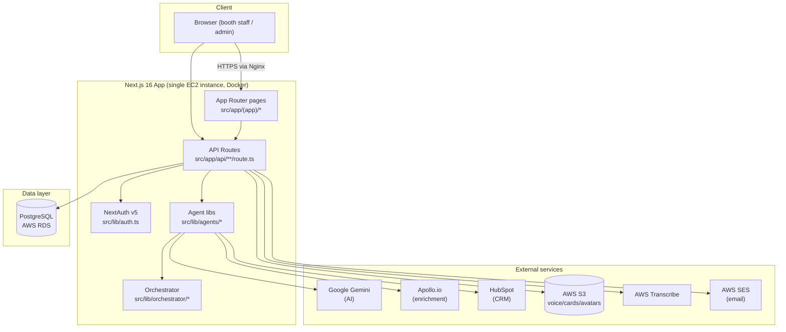
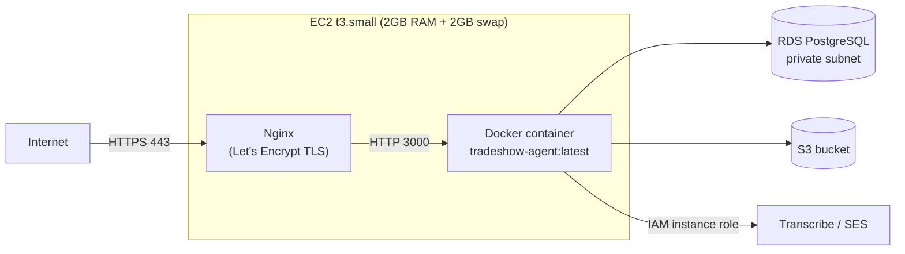

# 02 — System Architecture

## High-level architecture

## Request flow

All UI is server-rendered via Next.js App Router. Pages under `src/app/(app)/` are server components that query the database directly (no separate backend) and pass data to client components for interactivity. API routes under `src/app/api/` handle mutations and anything that needs to run server-side logic (auth checks, AI calls, S3 presigning).

There is **no standalone backend service** — Next.js's API routes are the entire backend. There is **no message queue or background worker** — the Agent Orchestrator runs synchronously inside the HTTP request that starts a workflow (see [06-ai-agent-architecture.md](06-ai-agent-architecture.md)).

## Layers

| Layer | Responsibility | Key paths |
|---|---|---|
| Pages (Server Components) | Auth-gated UI, direct DB reads for display | `src/app/(app)/**/page.tsx` |
| Pages (Client Components) | Interactivity, forms, client-side state | `src/app/(app)/**/*Client.tsx` |
| API Routes | Mutations, auth checks, AI/external API calls, S3 presigning | `src/app/api/**/route.ts` |
| Agent libraries | Business logic for each pipeline stage | `src/lib/agents/*` |
| Orchestrator | Chains agents into one workflow with retry | `src/lib/orchestrator/*` |
| Data access | Drizzle ORM schema + queries | `src/db/schema.ts`, inline in routes |
| Auth | Session/JWT, role checks, lockout | `src/lib/auth.ts`, `src/lib/permissions.ts` |
| Integrations | External API clients | `src/lib/enrichment/apollo.ts`, `src/lib/integrations/hubspot.ts`, `src/lib/aws/*`, `src/lib/email/*` |

## Why no separate backend / queue

This was a deliberate simplicity choice for the project's current scale (single small EC2 instance, modest lead volume per event). The Agent Orchestrator's `AgentAdapter` interface (`src/lib/orchestrator/types.ts`) is explicitly designed as the seam for migrating to AWS Step Functions or Bedrock AgentCore later without touching the agent logic itself — see [17-future-roadmap.md](17-future-roadmap.md).

## Deployment architecture

See [10-aws-infrastructure.md](10-aws-infrastructure.md) for the full breakdown including why swap was added (build-time OOM under load) and [09-deployment-guide.md](09-deployment-guide.md) for the deploy procedure.

## Multi-tenancy

Every business table carries a `tenant_id` and every query is scoped to the caller's tenant except `platform_admin`-only routes. See [08-multi-tenant-architecture.md](08-multi-tenant-architecture.md).

Tenant resolution by subdomain (e.g. `demo.tradeshow-agent.gtmtechsol.ai`) is implemented at the `src/proxy.ts` layer (this fork's `middleware.ts` equivalent — see root `AGENTS.md`) and enforced in `authorize()` (`src/lib/auth.ts`). The apex domain remains tenant-agnostic (legacy behavior) until wildcard DNS is enabled — see [08-multi-tenant-architecture.md](08-multi-tenant-architecture.md)'s "Subdomain strategy" section for the apex-vs-subdomain distinction, and `docs/deployment-checklist.md` for the prepared (not yet executed) rollout plan.
