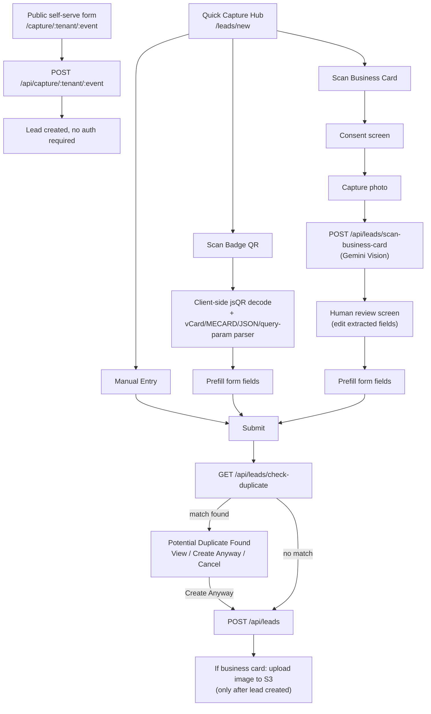
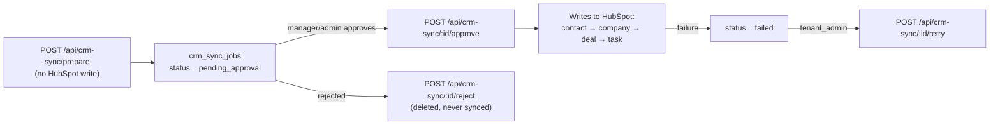
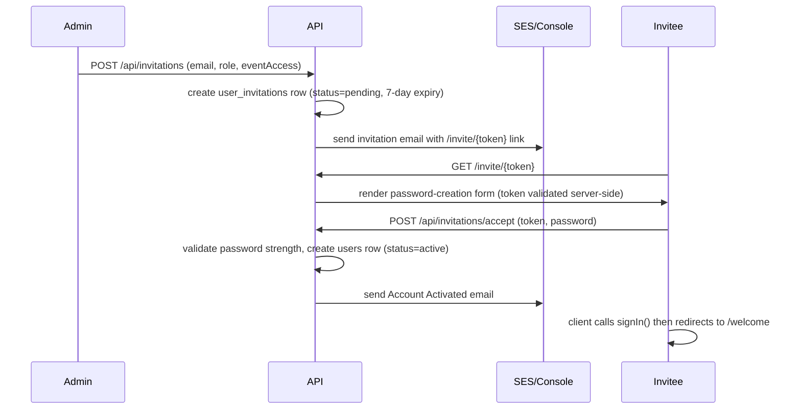

# 03 — Business Workflows

## Lead Capture

Four entry points, all converging on the same `leads` table (distinguished by `source` enum: `manual`, `qr_form`, `qr_badge_scan`, `business_card`):

**Key rule:** the business card photo is only persisted to S3 *after* the lead is successfully created — never before. OCR extraction itself is stateless (no DB write) until the user accepts the reviewed fields.

## QR Badge Scan

Client-side only — `jsQR` decodes the badge's QR payload in the browser via canvas polling, then a fallback parser chain tries vCard → MECARD → JSON → `mailto:`/`tel:` → URL query params → raw text (dumped into Notes for manual review if nothing parses). No server round-trip for decoding. See `src/components/QRBadgeScanner.tsx`.

## Business Card OCR

1. Consent screen shown before camera even opens (explicit per-card consent, separate from the lead's general contact consent).
2. Photo captured (canvas `toBlob`, max 5MB).
3. `POST /api/leads/scan-business-card` sends the base64 image to Gemini Vision (`extractBusinessCard` in `src/lib/ai/provider.ts`), returns extracted fields — nothing written to the database at this point.
4. User reviews/edits the extracted fields on screen — **OCR output is never trusted automatically**.
5. On accept, fields prefill the lead form; the photo blob and OCR metadata stay in browser state until the lead is actually created, at which point `POST /api/business-cards/initiate-upload` → S3 PUT → `POST /api/business-cards/complete-upload` persists it.

## Voice Notes & Transcription

Recorded in-browser (`MediaRecorder`), uploaded to S3 via presigned URL (`src/components/VoiceRecorder.tsx`), then transcription is started on demand (not automatic — costs AWS Transcribe credits, so the UI requires an explicit confirmation click). `POST /api/transcripts/start` kicks off an async AWS Transcribe job; `GET /api/transcripts/status` polls and syncs status, pulling the final transcript JSON from S3 once complete.

## Conversation Intelligence

Triggered manually (`POST /api/conversation-insights/analyze`) or as orchestrator step 1. Input is either a manually pasted transcript, a completed `transcripts` row, or the lead's free-text notes. Output: pain points, urgency, timeline, budget/decision-maker signals, next-best-action — all via Gemini with a strict JSON schema. Confidence < 70 auto-flags `needs_human_review`.

## Lead Qualification (Scoring)

Deterministic formula (not AI) across six weighted components — Company Fit, Authority, Need, Urgency, Engagement, Data Quality — summing to a 0–100 score. AI only adds a plain-English explanation, drivers, and risks on top of the already-computed score; it cannot change the number. Classification thresholds: ≥80 hot, ≥55 warm, else cold (or `needs_review` if confidence/data is too thin). See [06-ai-agent-architecture.md](06-ai-agent-architecture.md) for the exact formula.

## Opportunity Creation

A lead can become an `opportunities` record once qualified. Booth users need a Hot/Warm score (or explicit manager override) to create one; managers/admins can create regardless. Opportunities track stage (`identified` → ... → `won`/`lost`), amount, probability, and expected revenue, with an append-only `opportunity_activities` log for notes/calls/stage changes.

## CRM Sync

Sync plan depends on lead classification: hot → contact+company+deal+task; warm → contact+company+task; cold → contact only; `needs_review` → blocked entirely. **No code path syncs to HubSpot without an explicit approval action by a manager or tenant_admin.**

## ROI Analytics

Per-event, fully deterministic aggregation (`recalculateAndStoreROI`): total cost, lead/qualified/hot counts, pipeline generated, expected/won/lost revenue, ROI%, cost-per-lead/qualified-lead/opportunity. An AI executive summary is layered on top purely as narrative — it summarizes the already-computed numbers, never recalculates them, and falls back to a deterministic template if Gemini is unavailable. Exportable as PDF or Excel (tenant_admin only).

## User Management — Invitation Flow

Note: **no `users` row exists until the invitation is accepted** — this avoids dangling unusable accounts and email-uniqueness collisions while an invite is still pending.

## Password Reset

Two trigger paths, same underlying mechanism (`password_reset_tokens`, 1-hour expiry, single-use):
- **Self-service:** `/forgot-password` → `POST /api/auth/forgot-password` (always returns success, no email enumeration) → emailed link → `/reset-password?token=...`.
- **Admin-initiated:** `POST /api/users/:id/reset-password` (tenant_admin+) sends the *same* email-link flow — admins can no longer see or set a raw password directly.

Both paths reject reuse of the last 5 passwords (`password_history` table) and enforce the strength policy (12+ chars, upper/lower/digit/special).
