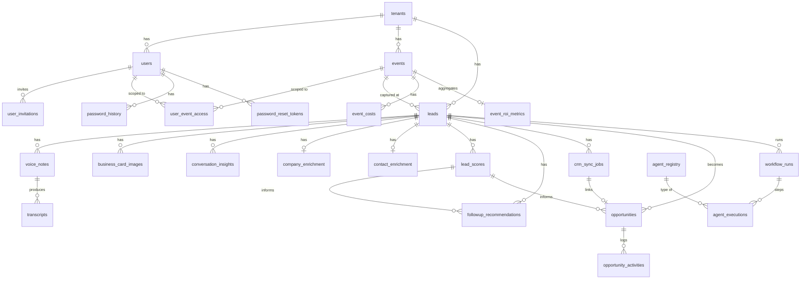

# 04 — Database Schema

PostgreSQL via Drizzle ORM. Schema source of truth: `src/db/schema.ts`. Migrations are **hand-applied `.sql` files** in `drizzle/` — there is no migration runner; see [09-deployment-guide.md](09-deployment-guide.md).

## Migration history

| # | File | Adds |
|---|---|---|
| 1 | `0001_initial.sql` | tenants, users, audit_logs |
| 2 | `0002_events_leads.sql` | events, leads |
| 3 | `0003_voice_notes.sql` | voice_notes |
| 4 | `0004_transcripts.sql` | transcripts |
| 5 | `0005_conversation_insights.sql` | conversation_insights |
| 6 | `0006_enrichment.sql` | company_enrichment, contact_enrichment |
| 7 | `0007_lead_scores.sql` | lead_scores |
| 8 | `0008_followup_recommendations.sql` | followup_recommendations |
| 9 | `0009_crm_sync_jobs.sql` | crm_sync_jobs |
| 10 | `0010_opportunities.sql` | opportunities, opportunity_activities |
| 11 | `0011_event_roi.sql` | event_costs, event_roi_metrics |
| 12 | `0012_orchestrator.sql` | agent_registry, workflow_runs, agent_executions, agent_policies (+ seed data) |
| 13 | `0013_quick_capture.sql` | business_card_images, leads QR columns, `qr_badge_scan` source value |
| 14 | `0014_iam.sql` | password_history, user_invitations, user_event_access, password_reset_tokens, users lifecycle columns, audit_logs.ip_address |

Schema and migrations are confirmed in sync — every table/enum in `schema.ts` has a matching `CREATE TABLE`/`CREATE TYPE` in the migrations.

## Entity-relationship diagram

## Enums

| Enum | Values |
|---|---|
| `tenant_status` | active, inactive |
| `user_role` | platform_admin, tenant_admin, manager, booth_user |
| `user_status` | active, inactive, invited, suspended, locked |
| `invitation_status` | pending, accepted, expired, cancelled |
| `event_status` | upcoming, active, completed, cancelled |
| `lead_source` | manual, qr_form, business_card, qr_badge_scan |
| `lead_status` | new, contacted, qualified, disqualified |
| `recording_status` | pending_upload, uploaded, failed, deleted |
| `transcription_status` | not_started, pending, completed, failed |
| `ocr_status` | not_started, pending, completed, failed |
| `ocr_review_status` | pending_review, reviewed, rejected |
| `transcribe_status` | not_started, queued, in_progress, completed, failed |
| `insight_input_source` | manual_transcript, transcript_table, lead_notes |
| `insight_urgency` | low, medium, high, unknown |
| `insight_status` | completed, failed, needs_review |
| `enrichment_status` | not_enriched, enriched, partially_enriched, failed, needs_review |
| `score_classification` | hot, warm, cold, needs_review |
| `score_status` | completed, failed, needs_review |
| `followup_type` | email, linkedin, meeting_request, phone_call |
| `followup_priority` | high, medium, low |
| `followup_timing` | immediate, 24_hours, 3_days, 1_week, 2_weeks |
| `followup_status` | draft, approved, rejected |
| `crm_sync_type` | contact, company, deal, task, full_sync |
| `crm_sync_status` | pending_approval, approved, queued, processing, completed, failed |
| `opportunity_stage` | identified, qualified, meeting_scheduled, proposal_requested, proposal_sent, negotiation, won, lost |
| `opportunity_priority` | high, medium, low |
| `opportunity_source` | trade_show, manual, crm_sync |
| `opportunity_status` | active, won, lost, archived |
| `opportunity_activity_type` | note, call, email, meeting, task, stage_change, crm_sync, follow_up |
| `event_cost_category` | booth, travel, hotel, marketing, sponsorship, staff, collateral, other |
| `agent_status` | active, inactive, maintenance |
| `agent_execution_status` | queued, running, completed, failed, cancelled, skipped |
| `workflow_status` | queued, running, completed, failed, cancelled |

## Tables

### tenants
Root multi-tenant container. `id, name, slug (unique), subdomain (unique), eventName, status, createdAt, updatedAt`. No FKs (root table). No soft delete.

### users
Accounts scoped to a tenant. `id, tenantId → tenants (CASCADE), name, email (unique), passwordHash, role, status, failedLoginAttempts, lockedAt, lastLoginAt, lastActivityAt, sessionCount, avatarUrl, allEvents, onboardingStep, onboardingCompletedAt, createdAt, updatedAt`. Index: `(tenantId)`. `allEvents=true` by default (unrestricted) — see [08-multi-tenant-architecture.md](08-multi-tenant-architecture.md) for event-scoping. No soft delete (deactivation is via `status`, not row deletion).

### password_history
Last-N password hashes for reuse prevention. `id, userId → users (CASCADE), passwordHash, createdAt`. Index: `(userId)`.

### user_invitations
Pending/accepted/expired/cancelled invites — **no `users` row exists until accepted**. `id, tenantId → tenants (CASCADE), email, firstName, lastName, role, eventAccess (jsonb: "all" | uuid[]), message, invitationToken (unique), status, expiresAt, acceptedAt, invitedBy → users (SET NULL), createdAt`. Indexes: `(tenantId)`, `(email)`, `(tenantId, status)`.

### user_event_access
Junction table; only consulted when `users.allEvents = false`. Composite PK `(userId, eventId)`. `userId → users (CASCADE), eventId → events (CASCADE), createdAt`. Index: `(userId)`.

### password_reset_tokens
1-hour single-use tokens for both self-service and admin-initiated resets. `id, userId → users (CASCADE), token (unique), expiresAt, usedAt, createdAt`. Index: `(userId)`.

### audit_logs
Immutable action log. `id, tenantId → tenants (SET NULL), userId → users (SET NULL), action, resourceType, resourceId, metadata (jsonb), ipAddress, createdAt`. Indexes: `(tenantId)`, `(createdAt)`. Append-only, never updated or deleted.

### events
Trade shows. `id, tenantId → tenants (CASCADE), name, slug, location, startDate, endDate, status, createdAt, updatedAt`. Indexes: `(tenantId)`, `(tenantId, slug)`.

### leads
Core captured-contact entity. `id, tenantId → tenants (CASCADE), eventId → events (SET NULL), createdByUserId → users (SET NULL), firstName, lastName, jobTitle, companyName, email, phone, country, source, consentGiven, consentTimestamp, status, notes, qrRawText, qrScannedAt, captureDurationSeconds, createdAt, updatedAt`. Indexes: `(tenantId)`, `(eventId)`, `(tenantId, status)`, `(createdByUserId)`. `qrRawText`/`qrScannedAt`/`captureDurationSeconds` added in migration 0013.

### voice_notes
Audio captures. `id, tenantId → tenants (CASCADE), eventId → events (SET NULL), leadId → leads (CASCADE), createdByUserId → users (SET NULL), s3Bucket, s3Key, fileName, fileType, fileSizeBytes (text), durationSeconds (text), recordingStatus, transcriptionStatus, retentionDeleteAt, deletedAt, createdAt, updatedAt`. Indexes: `(tenantId)`, `(leadId)`, `(tenantId, recordingStatus)`. **Soft delete:** `deletedAt`. **Retention:** `retentionDeleteAt` set to +30 days on upload.

### business_card_images
Scanned card photos. `id, tenantId → tenants (CASCADE), eventId → events (SET NULL), leadId → leads (CASCADE), createdByUserId → users (SET NULL), s3Bucket, s3Key, fileName, fileType, fileSizeBytes (text), uploadStatus (reuses recording_status), ocrStatus, ocrReviewStatus, ocrRawText, extractedFieldsJson, cardConsentConfirmed, cardConsentTimestamp, retentionDeleteAt, deletedAt, createdAt, updatedAt`. Indexes: `(tenantId)`, `(leadId)`, `(tenantId, uploadStatus)`. **Soft delete + retention** same pattern as voice_notes (+30 days).

### transcripts
Transcription output. `id, tenantId → tenants (CASCADE), eventId → events (SET NULL), leadId → leads (CASCADE), voiceNoteId → voice_notes (CASCADE), createdByUserId → users (SET NULL), transcribeJobName (unique), transcribeStatus, transcriptText, transcriptJsonS3Key, languageCode (default en-GB), confidenceScore, failureReason, startedAt, completedAt, createdAt, updatedAt`. Indexes: `(tenantId)`, `(leadId)`, `(voiceNoteId)`, `(tenantId, transcribeStatus)`.

### conversation_insights
AI-extracted conversation intelligence. `id, tenantId → tenants (CASCADE), eventId → events (SET NULL), leadId → leads (CASCADE), voiceNoteId → voice_notes (SET NULL), transcriptId → transcripts (SET NULL), createdByUserId → users (SET NULL), inputSource, inputText, painPoints (jsonb), productInterest (jsonb), businessNeed, urgency, timeline, budgetSignal, decisionMakerSignal, competitorMentioned, nextBestAction, summary, recommendedFollowUp, confidenceScore (numeric 5,2), aiModelUsed, aiRawResponse (jsonb), status, failureReason, createdAt, updatedAt`. Indexes: `(tenantId)`, `(leadId)`, `(tenantId, status)`, `(tenantId, urgency)`.

### company_enrichment / contact_enrichment
Apollo-sourced company and person data, one-to-one-ish with leads (one row per lead, re-enrichable). Both: `id, tenantId → tenants (CASCADE), leadId → leads (CASCADE), ... , enrichmentStatus, needsReview, failureReason, createdAt, updatedAt`. company_enrichment adds website/linkedinUrl/industry/employeeCount/employeeRange/annualRevenue/headquarters/foundedYear/apolloCompanyId. contact_enrichment adds firstName/lastName/linkedinUrl/seniority/department/jobFunction/apolloContactId. Indexes: `(tenantId)`, `(leadId)` on each; company_enrichment adds `(tenantId, enrichmentStatus)`.

### lead_scores
Deterministic score + AI explanation. `id, tenantId → tenants (CASCADE), eventId → events (SET NULL), leadId → leads (CASCADE), createdByUserId → users (SET NULL), score (numeric 5,2), classification, companyFitScore, authorityScore, needScore, urgencyScore, engagementScore, dataQualityScore (all numeric 5,2, default 0), estimatedOpportunityValue, estimatedCloseProbability, expectedRevenue, scoreExplanation, scoreDrivers (jsonb), risks (jsonb), recommendedNextAction, confidenceScore, needsHumanReview, modelUsed, rawAiResponse (jsonb), status, failureReason, createdAt, updatedAt`. Indexes: `(tenantId)`, `(leadId)`, `(tenantId, classification)`, `(tenantId, score DESC)`, `(tenantId, createdAt DESC)`.

### followup_recommendations
Draft follow-ups. `id, tenantId → tenants (CASCADE), eventId → events (SET NULL), leadId → leads (CASCADE), leadScoreId → lead_scores (SET NULL), createdByUserId → users (SET NULL), followupType, priority, recommendedTiming, subjectLine, messageContent, callToAction, reasoning, personalizationPoints (jsonb), confidenceScore, needsHumanReview, status (draft/approved/rejected), modelUsed, rawAiResponse (jsonb), createdAt, updatedAt`. Indexes: `(tenantId)`, `(leadId)`, `(tenantId, status)`, `(tenantId, priority)`, `(tenantId, createdAt DESC)`.

### crm_sync_jobs
HubSpot sync queue. `id, tenantId → tenants (CASCADE), eventId → events (SET NULL), leadId → leads (CASCADE), createdByUserId → users (SET NULL), syncType, syncStatus (pending_approval default), hubspotContactId, hubspotCompanyId, hubspotDealId, hubspotTaskId, syncPayload (jsonb), syncResponse (jsonb), failureReason, approvedByUserId → users (SET NULL), approvedAt, createdAt, updatedAt`. Indexes: `(tenantId)`, `(leadId)`, `(tenantId, syncStatus)`, `(tenantId, createdAt DESC)`.

### opportunities
Sales pipeline entries. `id, tenantId → tenants (CASCADE), eventId → events (SET NULL), leadId → leads (CASCADE), leadScoreId → lead_scores (SET NULL), crmSyncJobId → crm_sync_jobs (SET NULL), createdByUserId → users (SET NULL), ownerUserId → users (SET NULL), opportunityName, companyName, contactName, stage, priority, amount, probability, expectedRevenue, expectedCloseDate, source, nextStep, riskNotes, aiRecommendation, status (active/won/lost/archived), createdAt, updatedAt`. Indexes: `(tenantId)`, `(leadId)`, `(tenantId, stage)`, `(tenantId, status)`, `(tenantId, ownerUserId)`, `(tenantId, createdAt DESC)`.

### opportunity_activities
Append-only activity log (no `updatedAt`). `id, tenantId → tenants (CASCADE), opportunityId → opportunities (CASCADE), leadId → leads (CASCADE), createdByUserId → users (SET NULL), activityType, description, metadata (jsonb), createdAt`. Indexes: `(tenantId)`, `(opportunityId)`, `(opportunityId, createdAt DESC)`.

### event_costs
Itemized event spend. `id, tenantId → tenants (CASCADE), eventId → events (CASCADE), costCategory, description, amount (numeric 12,2, default 0), createdByUserId → users (SET NULL), createdAt, updatedAt`. Indexes: `(tenantId)`, `(eventId)`.

### event_roi_metrics
One row per event (UNIQUE on `eventId`), recalculated on demand. `id, tenantId → tenants (CASCADE), eventId → events (CASCADE, UNIQUE), totalEventCost, totalLeads, qualifiedLeads, hotLeads, opportunitiesCreated, pipelineGenerated, expectedRevenue, wonRevenue, lostRevenue, roiPercentage, costPerLead, costPerQualifiedLead, costPerOpportunity, executiveSummary, summaryGeneratedAt, summaryConfidenceScore, summaryModelUsed, createdAt, updatedAt`. Indexes: `(tenantId)`, `(eventId)`.

### agent_registry
Catalog of orchestrator-runnable agents (seeded, rarely written after). `id, agentName (unique), agentType, description, version, status, supportsRetry, maxRetries (default 3), executionTimeoutSeconds (default 60), createdAt, updatedAt`. Seeded: conversation_agent, enrichment_agent, lead_scoring_agent, followup_agent, crm_sync_agent, roi_agent.

### workflow_runs
One row per orchestrator run. `id, tenantId → tenants (CASCADE), leadId → leads (CASCADE), eventId → events (SET NULL), workflowName (default lead_qualification), status, startedAt, completedAt, currentStep, totalSteps (default 6), createdByUserId → users (SET NULL), createdAt, updatedAt`. Indexes: `(tenantId)`, `(leadId)`, `(tenantId, status)`, `(tenantId, createdAt DESC)`.

### agent_executions
One row per agent step within a workflow run (append-only, no `updatedAt`). `id, tenantId → tenants (CASCADE), leadId → leads (CASCADE), eventId → events (SET NULL), workflowId → workflow_runs (CASCADE), agentName, stepOrder, status, startedAt, completedAt, durationMs, retryCount, inputPayload (jsonb), outputPayload (jsonb), errorMessage, createdAt`. Indexes: `(tenantId)`, `(leadId)`, `(workflowId)`, `(tenantId, agentName)`, `(tenantId, status)`, `(tenantId, createdAt DESC)`.

### agent_policies
Configuration gates for agent behavior (e.g. score thresholds). `id, agentName, policyName, policyType, enabled (default true), configuration (jsonb), createdAt, updatedAt`. Index: `(agentName)`. Not FK'd to `agent_registry.agentName` (string match only). Seeded with 3 policies — see [06-ai-agent-architecture.md](06-ai-agent-architecture.md).

## Soft-delete / retention summary

Only `voice_notes` and `business_card_images` implement soft delete (`deletedAt`) and retention (`retentionDeleteAt`, +30 days from upload). No automated job purges expired rows yet — see [19-known-limitations.md](19-known-limitations.md). Every other table is either append-only (audit_logs, opportunity_activities, agent_executions) or uses a `status` enum for lifecycle instead of deletion (e.g. `users.status`, `leads.status`).
