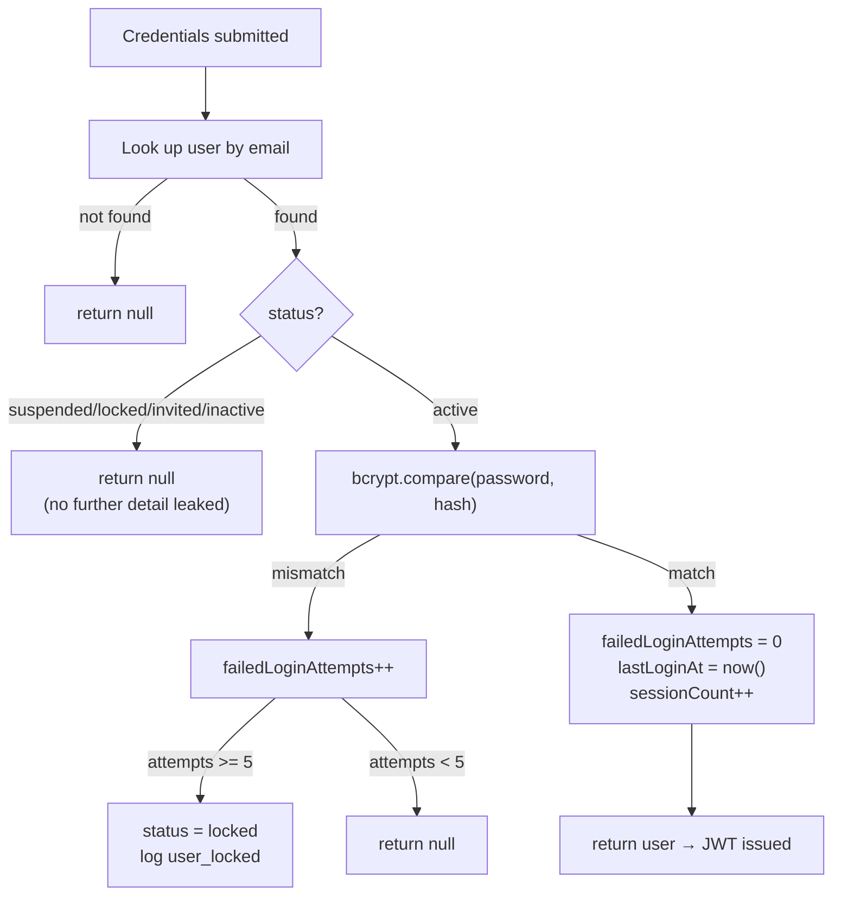

# 07 — Authentication & Security

## NextAuth v5 (JWT sessions)

- **File:** `src/lib/auth.ts`. Single `Credentials` provider (email + password); no OAuth providers configured yet.
- **Session strategy:** JWT (`session: { strategy: "jwt" }`) — no server-side session store; all session state lives in the signed cookie.
- **`trustHost: true`** is set explicitly — required for Auth.js v5 behind a reverse proxy (Nginx) on a custom domain; without it every request fails with `UntrustedHost`. This was a real production incident during initial deployment — see [16-troubleshooting.md](16-troubleshooting.md).
- **`session.user.id` bug (fixed):** for a period, the `jwt`/`session` callbacks only copied `role`/`tenantId` from the user object, never `id` — meaning `session.user.id` was `undefined` everywhere it was used (every `createdByUserId` on leads, every `userId` on audit logs silently wrote `NULL`). Fixed by adding `token.id = user.id` in the `jwt` callback and `session.user.id = token.id` in the `session` callback, plus the corresponding type declarations in `src/types/next-auth.d.ts`. **If you ever see `createdByUserId`/audit `userId` coming back null in new code, check this first.**

## authorize() flow

## Roles

`platform_admin > tenant_admin > manager > booth_user` (`src/lib/permissions.ts`, `ROLE_RANK`). `hasRole()` does a numeric comparison; `isPlatformAdmin`/`isTenantAdmin`/`isManager` are convenience wrappers. `canAssignRole(actorRole, targetRole)` prevents privilege escalation when inviting/creating users — a tenant_admin can only assign manager/booth_user, never tenant_admin or platform_admin.

| Role | Scope | Typical restriction pattern in API routes |
|---|---|---|
| `platform_admin` | Cross-tenant | Can specify `tenantId` explicitly; sees all tenants on list routes; explicitly **forbidden** from opportunity-financial-field edits and some operational actions (it's an oversight/admin role, not a salesperson role) |
| `tenant_admin` | Own tenant | Full control within tenant: invite/suspend/unlock users, approve CRM syncs, export reports |
| `manager` | Own tenant | Can approve CRM syncs and follow-ups, edit opportunity financial fields, cannot manage users |
| `booth_user` | Own tenant, own records | Restricted to leads/workflows/opportunities/voice-notes/etc. they personally created; cannot touch CRM sync approval or opportunity financial fields |

## Tenant isolation

Every business query filters by `tenantId` derived from the authenticated session — never from client-supplied input (except `platform_admin`, which may specify a target tenant explicitly for cross-tenant admin actions). See [08-multi-tenant-architecture.md](08-multi-tenant-architecture.md) for the full model.

## Account lockout

5 consecutive failed login attempts → `status = locked`, `locked_at` set, `user_locked` audit logged. Unlock paths: (1) tenant_admin clicks "Unlock" on the Users page (`PATCH /api/users/:id` with `unlock: true`, clears `failedLoginAttempts`/`lockedAt`), or (2) the user completes a password reset, which also clears the lock.

## Password policy

`src/lib/password.ts`: minimum 12 characters, must include uppercase, lowercase, digit, and special character. `isPasswordReused()` checks the new plaintext against the current hash plus the last 5 entries in `password_history` (bcrypt comparison against each). Enforced on: self-service change-password, self-service forgot/reset-password, admin-initiated reset, and invitation acceptance.

## Invitations as the primary onboarding path

`POST /api/users` (direct create with a password) still exists but is considered legacy — invitations (`/api/invitations`) are the intended flow. No `users` row exists for an invited person until they accept; this avoids both dangling unusable accounts and the email-uniqueness collision that would occur if a "ghost" account existed pre-acceptance.

## Password reset — never a visible temp password

Both self-service and admin-initiated resets go through the same `password_reset_tokens` mechanism (1-hour expiry, single-use, emailed link). `PATCH /api/users/:id` does **not** accept a raw password field at all — there is no remaining code path where an admin can see or set a user's password directly. (Earlier in this project's history, admin "reset password" generated and displayed a temp password in a toast; this was replaced specifically because it was a real security smell flagged during development.)

## Audit logging

Every identity/security-relevant action writes to `audit_logs` with `tenantId`, `userId`, `action`, `resourceType`, `resourceId`, `metadata`, `ipAddress` (read from `X-Forwarded-For`, since Nginx sits in front), and `createdAt`. Action names in use: `user_invited`, `invitation_accepted`, `invitation_resent`, `invitation_cancelled`, `password_changed`, `password_reset`, `password_reset_requested`, `user_suspended`, `user_activated`, `user_locked`, `role_changed`, `event_access_changed`, plus business-domain actions (`lead.created`, `crm_sync_completed`, `workflow_started`, etc.). `audit_logs` is append-only — nothing is ever updated or deleted from it.

## Security assumptions (explicit, not hidden)

- This is a B2B internal tool — login failure messages are deliberately generic (no "this account doesn't exist" vs "wrong password" distinction) but the threat model assumes cooperative tenants, not hostile public signup.
- SES is in **sandbox mode** in production — only a verified address (`info@gtmtechsol.com`) can currently receive real invitation/reset emails until AWS approves production access. See [11-integrations.md](11-integrations.md).
- No CSRF token is manually managed — NextAuth's built-in CSRF protection on the credentials callback is relied upon.
- No rate limiting exists on any API route beyond the 5-attempt login lockout. A scripted attacker could still hammer other endpoints.

## Future SSO readiness

The spec for Release 13.6 explicitly excluded Google SSO, Microsoft Entra ID, Okta, MFA, and SCIM — but shaped the codebase to add them later without rework:
- `src/lib/auth.ts`'s `providers` array is a single-entry array today; additional NextAuth providers (Google, Azure AD, Okta via OIDC) would be added as new array entries.
- The `EmailProvider` interface in `src/lib/email/types.ts` already generalizes beyond SES (Resend/SendGrid could be added as new implementations) — the same pattern would apply to an identity provider abstraction if multiple SSO providers were needed simultaneously.
- No SCIM endpoint or webhook exists; user provisioning today is 100% via the invitation flow.

**None of this is implemented** — it's a documented intention, not working code. Don't assume an SSO code path exists.
