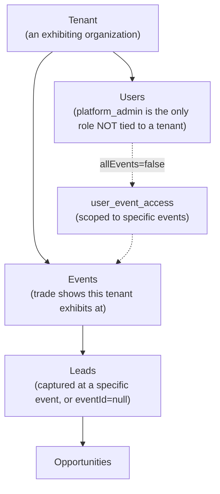
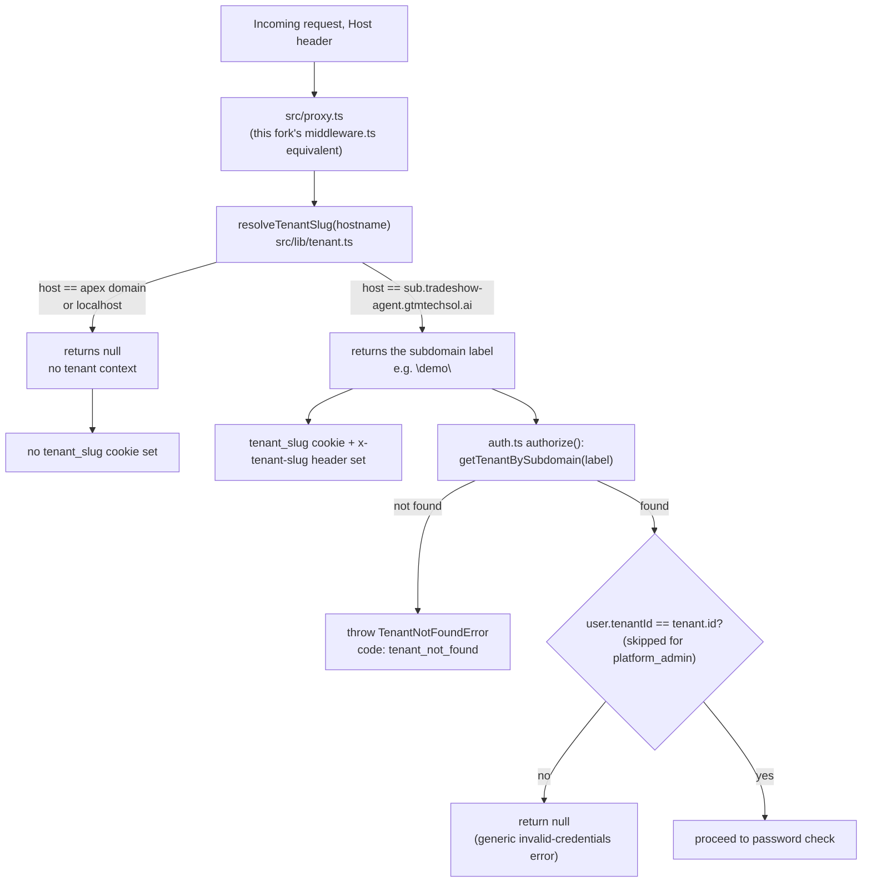

# 08 — Multi-Tenant Architecture

## Model

- **Tenant** is the top-level isolation boundary — one row in `tenants`, identified by a unique `slug` and `subdomain`.
- **User** belongs to exactly one tenant (`users.tenantId`), except `platform_admin`, whose `tenantId` is `null` — platform_admin is explicitly a cross-tenant operator role, not scoped to any single tenant's data by default.
- **Event** belongs to exactly one tenant; it's the trade show itself (name, location, dates).
- **Lead** belongs to exactly one tenant and optionally one event (`eventId` is nullable — a lead can exist without being tied to a specific show).
- **Opportunity** inherits tenant scoping from its parent lead.

## Data isolation enforcement

Every multi-tenant table carries a `tenant_id` foreign key. The enforcement pattern in API routes is consistent: read `session.user.tenantId` from the authenticated session (never trust a client-supplied tenant id, except for `platform_admin` who may explicitly target another tenant), then add `eq(table.tenantId, tenantId)` to every query's WHERE clause. The code-inspection scan sampled `/api/leads`, `/api/users`, and `/api/business-cards` and found this pattern consistently applied with no missing tenant filters.

`booth_user` gets an *additional* narrowing on top of tenant scoping: most routes also filter `eq(table.createdByUserId, session.user.id)` for that role, so a booth_user only ever sees their own captured leads/workflows/voice-notes, not their whole tenant's data.

## Access rules summary

| Role | Tenant scope | Record scope |
|---|---|---|
| `platform_admin` | All tenants (or one, by explicit choice) | All records in scope |
| `tenant_admin` | Own tenant only | All records in tenant |
| `manager` | Own tenant only | All records in tenant |
| `booth_user` | Own tenant only | Only records they created |

## Per-user event access (Release 13.6)

Within a tenant, a user can additionally be restricted to specific *events* (not just the whole tenant). `users.allEvents` (boolean, default `true`) controls this: when `true`, the user sees everything in their tenant regardless of event; when `false`, `user_event_access` (a junction table) lists exactly which events they're allowed to see. `getAccessibleEventIds()` in `src/lib/event_access.ts` (sic — actual path `src/lib/event-access.ts`) returns `null` for unrestricted access, or an explicit array of allowed event IDs otherwise. This is enforced on `GET /api/leads` (leads with no event attached remain visible to everyone, regardless of restriction) and the event picker on `/leads/new` — **not** threaded into every nested route (voice-notes/business-cards/opportunities inherit lead-level scoping instead, which was a deliberate scope-limiting decision rather than an oversight).

## Subdomain strategy (updated 2026-06-27 — now implemented)

Each tenant has a `subdomain` column (e.g. `"demo"`), distinct from `slug` (e.g. `"demo-logistics"`) — `slug` is a general-purpose identifier used elsewhere (e.g. admin UI), while `subdomain` is specifically the short label intended for `{subdomain}.tradeshow-agent.gtmtechsol.ai`-style routing. **Tenant-from-subdomain resolution and tenant-scoped login are now implemented**, ahead of wildcard DNS actually going live publicly (see `docs/tenant-auth-review.md`, `docs/deployment-checklist.md`).

### How resolution works

### Apex domain vs tenant subdomain — the key distinction

| | Apex domain (`tradeshow-agent.gtmtechsol.ai`) | Tenant subdomain (`demo.tradeshow-agent.gtmtechsol.ai`) |
|---|---|---|
| `resolveTenantSlug()` returns | `null` | the subdomain label (e.g. `"demo"`) |
| Login behavior | Legacy, tenant-agnostic by email only — preserves today's production behavior, since wildcard DNS isn't live yet and this is the only entry point in use | Tenant-scoped — `authorize()` rejects valid credentials that belong to a *different* tenant than the one resolved from the subdomain |
| Unknown/unmapped subdomain | N/A (apex always resolves to `null`, never errors) | `TenantNotFoundError` (`code: tenant_not_found`) — distinct from a credentials error |
| `platform_admin` | Always allowed (no tenant restriction, by design — `tenantId` is `null` for this role) | Always allowed, regardless of which tenant's subdomain |
| Session cookie scope | N/A | Host-scoped by NextAuth default (no shared `cookies.domain` override) — a session on one tenant subdomain is not valid on another. This is intentional; see `docs/tenant-auth-review.md`. |

### Why apex must stay tenant-agnostic for now

Wildcard DNS has **not** been enabled yet (see `docs/deployment-checklist.md` — DNS is deliberately the last step, gated on this auth fix being validated first). Every real user currently logs in via the apex domain. If `authorize()` enforced tenant-scoping on the apex too, every login in production would need to resolve to *some* tenant — but the apex has no subdomain to resolve one from. Treating `slug === null` as "skip tenant enforcement" preserves exactly today's working behavior while adding real enforcement the moment a tenant subdomain is actually used (which already works today, pre-DNS, when tested directly via a `Host` header — see `docs/tenant-auth-review.md` for the verification method).

## Future enterprise model

Not yet built, but the schema and role hierarchy anticipate:
- SSO per tenant (see [07-authentication-security.md](07-authentication-security.md))
- Wildcard DNS + SSL to make tenant subdomains publicly reachable (resolution logic is ready; infrastructure is prepared but not executed — see `docs/wildcard-domain-review.md`, `docs/nginx-wildcard-plan.md`)
- Tenant-level billing/subscription (the Tenant Settings page has an explicitly labeled placeholder card only — no billing backend exists)
- Tenant-level feature flags or plan tiers (no such concept exists in the schema today)
