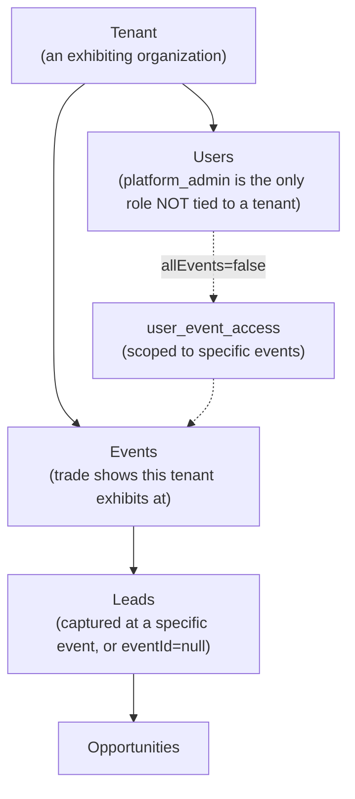

# 08 — Multi-Tenant Architecture

## Model

- **Tenant** is the top-level isolation boundary — one row in `tenants`, identified by a unique `slug` and `subdomain`.
- **User** belongs to exactly one tenant (`users.tenantId`), except `platform_admin`, whose `tenantId` is `null` — platform_admin is explicitly a cross-tenant operator role, not scoped to any single tenant's data by default.
- **Event** belongs to exactly one tenant; it's the trade show itself (name, location, dates).
- **Lead** belongs to exactly one tenant and optionally one event (`eventId` is nullable — a lead can exist without being tied to a specific show).
- **Opportunity** inherits tenant scoping from its parent lead.

## Data isolation enforcement

Every multi-tenant table carries a `tenant_id` foreign key. The enforcement pattern in API routes is consistent: read `session.user.tenantId` from the authenticated session (never trust a client-supplied tenant id, except for `platform_admin` who may explicitly target another tenant), then add `eq(table.tenantId, tenantId)` to every query's WHERE clause. The code-inspection scan sampled `/api/leads`, `/api/users`, and `/api/business-cards` and found this pattern consistently applied with no missing tenant filters.

`booth_user` gets an *additional* narrowing on top of tenant scoping: most routes also filter `eq(table.createdByUserId, session.user.id)` for that role, so a booth_user only ever sees their own captured leads/workflows/voice-notes, not their whole tenant's data.

## Access rules summary

| Role | Tenant scope | Record scope |
|---|---|---|
| `platform_admin` | All tenants (or one, by explicit choice) | All records in scope |
| `tenant_admin` | Own tenant only | All records in tenant |
| `manager` | Own tenant only | All records in tenant |
| `booth_user` | Own tenant only | Only records they created |

## Per-user event access (Release 13.6)

Within a tenant, a user can additionally be restricted to specific *events* (not just the whole tenant). `users.allEvents` (boolean, default `true`) controls this: when `true`, the user sees everything in their tenant regardless of event; when `false`, `user_event_access` (a junction table) lists exactly which events they're allowed to see. `getAccessibleEventIds()` in `src/lib/event_access.ts` (sic — actual path `src/lib/event-access.ts`) returns `null` for unrestricted access, or an explicit array of allowed event IDs otherwise. This is enforced on `GET /api/leads` (leads with no event attached remain visible to everyone, regardless of restriction) and the event picker on `/leads/new` — **not** threaded into every nested route (voice-notes/business-cards/opportunities inherit lead-level scoping instead, which was a deliberate scope-limiting decision rather than an oversight).

## Subdomain strategy

Each tenant has a `subdomain` column, intended for `{subdomain}.yourdomain.com`-style routing. **This is not currently wired up in production** — the live deployment serves a single domain (`tradeshow-agent.gtmtechsol.ai`) and resolves tenant by other means (session, cookie). The `subdomain` field exists in the schema as forward-looking infrastructure, not an active routing mechanism — see [19-known-limitations.md](19-known-limitations.md).

## Future enterprise model

Not yet built, but the schema and role hierarchy anticipate:
- SSO per tenant (see [07-authentication-security.md](07-authentication-security.md))
- Real subdomain-based tenant resolution (middleware-level routing, not implemented)
- Tenant-level billing/subscription (the Tenant Settings page has an explicitly labeled placeholder card only — no billing backend exists)
- Tenant-level feature flags or plan tiers (no such concept exists in the schema today)
