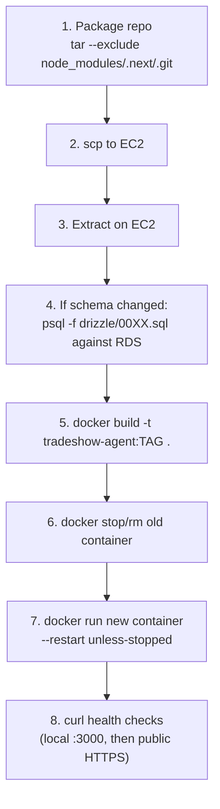

# 09 — Deployment Guide

## Local development

```sh
# 1. Postgres must be running on port 5433 (not the default 5432 — something
#    else on this machine may already own 5432; this project's data directory
#    needs to be started explicitly on 5433):
LC_ALL="en_US.UTF-8" /opt/homebrew/opt/postgresql@16/bin/pg_ctl \
  -D /opt/homebrew/var/postgresql@16 -o "-p 5433" -l /tmp/pg16.log start

# If a `brew services`-managed instance auto-starts on 5432 instead and grabs
# the lock file, stop it first: `brew services stop postgresql@16`

npm install
npm run dev      # http://localhost:3000 (or :3001 if :3000 is taken)
npm run build    # type-check + production build — use this to verify changes,
                  # there is no separate `tsc --noEmit` script wired up
npm run lint
```

Seed data (`npm run db:seed`) creates two tenants and one user per role, all password `Password123!`:

| Email | Role |
|---|---|
| `admin@platform.com` | platform_admin |
| `admin@demo.com` | tenant_admin |
| `manager@demo.com` | manager |
| `booth@demo.com` | booth_user |

`.env.local` is gitignored — see [12-environment-variables.md](12-environment-variables.md) for every variable it needs.

## Database migrations — no runner, applied by hand

```sh
psql -h localhost -p 5433 -d tradeshow_agent -v ON_ERROR_STOP=1 -f drizzle/0015_my_new_migration.sql
```

There is no `drizzle-kit migrate` step wired into any script — `db:generate`/`db:push` exist in `package.json` but the actual applied history is the hand-written `.sql` files in `drizzle/`, run in numeric order. If you add a table, write the next-numbered `.sql` file yourself and apply it to every environment (local, then production RDS) in the same order. **This is real technical debt** — see [19-known-limitations.md](19-known-limitations.md).

## Production deployment (current process — manual, not CI/CD)

The production environment is a single AWS EC2 instance running a Docker container, with no CI/CD pipeline — every deploy is a manual sequence run from a developer's machine:



```sh
# From local machine, with SSH key + EC2 IP known:
tar --exclude='node_modules' --exclude='.next' --exclude='.git' --exclude='.claude' --exclude='.env.local' -czf /tmp/app.tar.gz .
scp -i ~/.ssh/tradeshow-agent-key.pem /tmp/app.tar.gz ec2-user@<EC2_IP>:/home/ec2-user/app.tar.gz
ssh -i ~/.ssh/tradeshow-agent-key.pem ec2-user@<EC2_IP> "mkdir -p ~/app_new && tar -xzf app.tar.gz -C ~/app_new && cp ~/app_prev/.env.production ~/app_new/.env.production"

# Apply any new migration against RDS first (see drizzle/*.sql), then:
ssh -i ~/.ssh/tradeshow-agent-key.pem ec2-user@<EC2_IP> "cd ~/app_new && sudo docker build -t tradeshow-agent:NEWTAG ."
ssh -i ~/.ssh/tradeshow-agent-key.pem ec2-user@<EC2_IP> "
  sudo docker stop tradeshow-agent && sudo docker rm tradeshow-agent
  sudo docker run -d --name tradeshow-agent --restart unless-stopped \
    --env-file ~/app_new/.env.production -p 3000:3000 tradeshow-agent:NEWTAG
"
curl -s https://tradeshow-agent.gtmtechsol.ai/login   # should be 200
```

### Why the build sometimes fails (OOM) and the fix

The EC2 instance is a **t3.small (2GB RAM)**. `npm run build` for this app, especially after adding new dependencies, can exhaust that RAM during the Next.js build step, causing the box to thrash and even **stop responding to SSH** (not crash — `docker image inspect`/SSH connections time out at the banner-exchange stage while AWS reports the instance as healthy at the infra level). This happened during the IAM-release deploy.

**Fix already applied:** a 2GB swapfile was added and persisted in `/etc/fstab`:
```sh
sudo fallocate -l 2G /swapfile && sudo chmod 600 /swapfile && sudo mkswap /swapfile && sudo swapon /swapfile
echo '/swapfile swap swap defaults 0 0' | sudo tee -a /etc/fstab
```
If a build ever hangs again and SSH stops responding, the instance is usually still alive (`aws ec2 describe-instance-status` will show `running`/`ok`) — a `reboot-instances` API call recovers it in under a minute, and the running container auto-restarts (`--restart unless-stopped`) with minimal downtime. Always run the Docker build **in the background, detached from the SSH session** (`nohup ... &`, log to a file) so a dropped connection doesn't kill the build.

## Rollback

No automated rollback exists. The manual process: keep the previous Docker image tag around (don't `docker rmi` it immediately after a deploy), and if the new one misbehaves, re-run the `docker stop/rm/run` sequence pointing at the previous tag. Database migrations are **not** reversible by tooling — if a migration needs to be rolled back, you write and apply a hand-crafted down-migration `.sql` file yourself.

## Health checks

No `/health` or `/api/health` endpoint exists. The de facto check is `curl https://<domain>/login` returning 200, plus `docker ps` on the instance and `docker logs tradeshow-agent` for runtime errors.

## Environment-specific config

See [12-environment-variables.md](12-environment-variables.md) for the full variable list. Production secrets are stored in AWS Secrets Manager and pulled into a `.env.production` file on the EC2 instance at deploy time (not committed, not baked into the Docker image).
