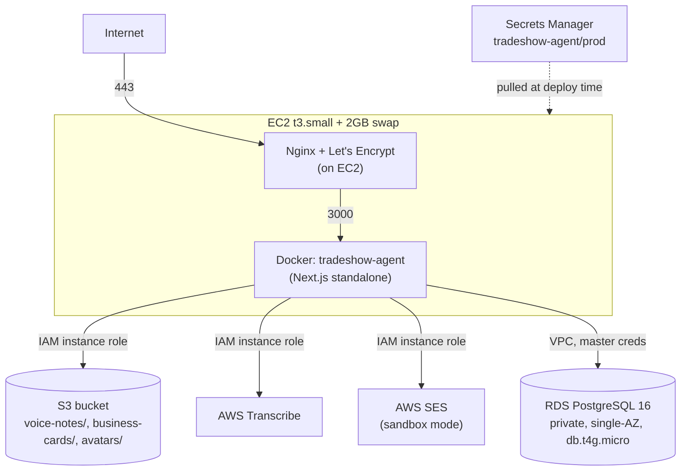

# 10 — AWS Infrastructure

## Architecture diagram

## Hosting — EC2

- **Instance:** t3.small (2 vCPU, 2GB RAM), Amazon Linux 2023, eu-central-1.
- **Elastic IP** attached so the address survives reboots.
- **Security groups:** one for the instance (22/80/443), one for RDS (5432, restricted to the EC2 security group only — not open to the internet).
- **Swap:** 2GB swapfile added after a build-time OOM incident (see [09-deployment-guide.md](09-deployment-guide.md)).
- **IAM instance role** (`tradeshow-agent-ec2-role`): scoped permissions for S3 (get/put/delete objects), Transcribe (start/get job), Secrets Manager (read the one secret), and SES (send email) — **no static AWS access keys live on the box**; everything authenticates via the instance role.
- **Docker + Nginx** installed via `dnf`, both enabled as systemd services so they survive reboots automatically.

## Database — RDS PostgreSQL

- **Engine:** PostgreSQL 16, `db.t4g.micro`, single-AZ (no Multi-AZ failover), 20GB storage, 1-day backup retention (the account is on the **AWS Free Tier**, which caps backup retention — anything beyond 1 day requires upgrading the account plan).
- **Network:** private — not publicly accessible; only reachable from the EC2 security group.
- **Connection:** `pg.Pool` with `max: 5`, `connectionTimeoutMillis: 10000`, optional SSL via `DATABASE_SSL=true` env var (`rejectUnauthorized: false` — RDS's own CA isn't in Node's default trust store path used here).
- **Migrations:** applied by hand via `psql` from the EC2 instance (RDS isn't publicly reachable from a local machine) — see [09-deployment-guide.md](09-deployment-guide.md).

## Storage — S3

One bucket, three key prefixes (configurable via env, defaults shown):
- `voice-notes/{tenantId}/{eventId}/{leadId}/{voiceNoteId}.{ext}`
- `business-cards/{tenantId}/{eventId}/{leadId}/{businessCardImageId}.{ext}`
- `avatars/{userId}.{ext}`

All access via presigned URLs generated server-side (`src/lib/aws/s3.ts`) — uploads are 10-minute PUT URLs, downloads are 60-minute GET URLs. The client never receives raw AWS credentials.

## Transcribe

Async speech-to-text for voice notes. **Known limitation:** AWS Transcribe is *configured* (env vars set, IAM permission granted) but this AWS account itself is not subscribed to the service — every transcription start attempt currently fails with `SubscriptionRequiredException`. This is surfaced honestly in the UI ("Needs Attention" in the Integrations card) rather than hidden. Fixing it requires an AWS account-level action outside the application, not a code change.

## Email — SES

- **Status:** Sandbox mode. `ProductionAccessEnabled: false` as of the last check.
- **Verified sending identity:** `info@gtmtechsol.com` (single email, not a verified domain).
- **Sandbox restriction:** in sandbox, SES can only send *to* verified addresses too — so right now, real invitation/reset emails only land for `info@gtmtechsol.com`, regardless of who they're nominally addressed to in the app.
- **Production access request:** submitted via `aws sesv2 put-account-details --production-access-enabled` — this queues an AWS review (typically 24h+) and is not something that can be force-completed programmatically.
- **Default fallback:** `EMAIL_PROVIDER` unset or not `"ses"` → `ConsoleProvider`, which just logs the email instead of sending — safe default for local dev.

## Future (explicitly not implemented)

- **Bedrock AgentCore** — the orchestrator's `AgentAdapter` interface is the seam for this; no Bedrock code exists today.
- **CloudWatch** — no dashboards, alarms, or log groups are configured; `docker logs` on the instance is the only current observability.
- **Step Functions** — same seam as Bedrock; not implemented.

See [17-future-roadmap.md](17-future-roadmap.md).
