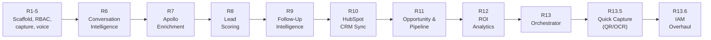

# 17 — Future Roadmap

## Completed

See [18-release-history.md](18-release-history.md) for what each release actually shipped.

## Proposed future releases (not committed — directional only)

| Release | Theme | Depends on |
|---|---|---|
| 14 | Real AWS Step Functions / Bedrock AgentCore swap for the orchestrator — the `AgentAdapter` seam exists for exactly this | None — adapter pattern already in place |
| 15 | Deeper analytics — cross-event trends, cohort analysis, predictive lead scoring | Requires more historical data volume to be useful |
| 16 | Enterprise — real SSO (Google/Entra/Okta), MFA, SCIM provisioning, subdomain-based tenant routing | `EmailProvider`-style abstraction pattern, `providers` array extension in `auth.ts` |
| 17 | Marketplace / multi-vendor — not yet scoped at all | Significant tenant model rework likely needed |
| 18 | AI Copilot — conversational interface over the existing agents | Existing agent outputs as the data layer |
| 19 | Mobile app — native wrapper or PWA hardening for the booth-capture flow specifically | Quick Capture UI already mobile-first; native app would be additive |

**These are illustrative placeholders carried over from planning discussions, not a committed roadmap** — no release beyond 13.6 has actual scoped requirements yet. Don't treat the release numbers/themes above as promises; treat [19-known-limitations.md](19-known-limitations.md) as the more concrete "what's actually missing" list to draw the next real release from.

## Near-term technical debt to address before new features

These come directly from `code-inspection-report.md` and are arguably higher priority than any new feature above:
1. Dashboard N+1 query pattern (ROI loop) — High severity performance issue.
2. Dashboard's 15+ sequential queries not batched — High severity, affects every page load.
3. No migration runner — every new table risks drift between environments (see [09-deployment-guide.md](09-deployment-guide.md)).
4. No automated test suite at all (see [15-testing-guide.md](15-testing-guide.md)).
