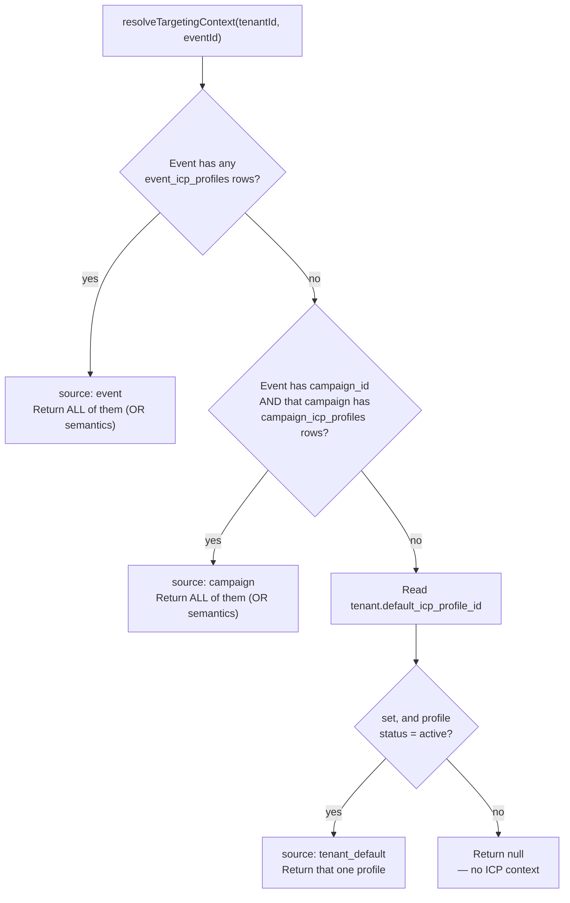

# ICP Architecture (Release 14.2 + 14.3 + 14.4)

Technical reference for the Configurable ICP foundation, administration layer, and unified multi-ICP targeting actually implemented. For the assessments that justified these designs, see [RELEASE-14-CONFIGURABLE-ICP.md](RELEASE-14-CONFIGURABLE-ICP.md) (R14.1/R14.2), [RELEASE-14.3-ICP-ADMIN.md](RELEASE-14.3-ICP-ADMIN.md) (R14.3), and [RELEASE-14.4-UNIFIED-TARGETING.md](RELEASE-14.4-UNIFIED-TARGETING.md) (R14.4 — the authoritative R14.4 doc; [RELEASE-14.3.1-14.4-ASSESSMENT.md](RELEASE-14.3.1-14.4-ASSESSMENT.md)'s R14.4 sections describe an earlier, superseded Campaign-only design). This doc describes what exists in code today — update it in the same PR as any future change to `src/lib/icp/*`, per this repo's normal documentation convention ([14-coding-standards.md](14-coding-standards.md)).

## What's built

- **Data model:** `icp_profiles` (tenant-scoped, Zod-validated JSON config); `tenants.default_icp_profile_id` (R14.3); `event_icp_profiles` and `campaign_icp_profiles` join tables + `campaigns` table + `events.campaign_id` (R14.4 — see below). `events.icp_profile_id` (R14.2) is kept for backward compatibility but is no longer the write target for new assignments.
- **Resolver:** `src/lib/icp/icp-resolver.ts` — the single place that reads/writes these tables. `resolveTargetingContext()` (R14.4) is the current entry point; `getActiveICPForEvent()` (R14.3) is kept unmodified since no production agent calls it.
- **Config schema:** `src/lib/icp/schema.ts` — Zod validation for `configuration_json`.
- **Shared fit module:** `src/lib/icp/fit.ts` — the R14.2 hardcoded-default industry check, the R14.3 qualitative Test Mode matcher, and (R14.4) Campaign Test Mode, which calls the same function once per Campaign ICP. One file, one source of truth for "how do we determine ICP fit," growing incrementally rather than fragmenting.
- **Admin UI:** `/settings/icp` (R14.3 — list + edit + Test Mode) and `/settings/campaigns` (R14.4 — list + edit + multi-select ICPs + Test Mode), both `tenant_admin`-only.
- **API routes:** full CRUD/lifecycle under `/api/icp-profiles/*` (R14.3) and `/api/campaigns/*` (R14.4), plus multi-ICP event-assignment wiring in `/api/events`.
- **What consumes ICP config today:** nothing agent-side yet. `lead-scoring.ts` and `CompanyIntelTab.tsx` still only use `fit.ts`'s fixed hardcoded default, **not** a resolved targeting context — that's Release 14.5 and later, explicitly deferred. R14.3/R14.4 are purely configuration/administration/resolution layers on top of R14.2's data model; `resolveTargetingContext()` is built and tested but has no caller yet.

## Data model

```
icp_profiles
  id                   uuid PK
  tenant_id            uuid → tenants (CASCADE)
  name                 varchar(255)
  description          text, nullable
  status               icp_status enum: draft | active | inactive   (default 'draft')
  version              integer                                       (default 1, bumped on configuration_json change only)
  configuration_json   jsonb, NOT NULL — validated by ICPConfigSchema before every write
  created_by_user_id   uuid → users (SET NULL)
  created_at / updated_at

events.icp_profile_id          uuid, nullable → icp_profiles (SET NULL)   -- Release 14.2, legacy
  kept for backward compatibility only — no longer written by new code.
  See event_icp_profiles below for the current source of truth.

tenants.default_icp_profile_id uuid, nullable → icp_profiles (SET NULL)   -- Release 14.3
  the tenant's explicit default, distinct from icp_profiles.status

tenants.plan_name              varchar(50), default 'trade_show_pro'      -- Release 14.3.1
  lightweight entitlement lookup key, see src/lib/plans.ts. No plans table.

event_icp_profiles             (event_id, icp_profile_id) UNIQUE           -- Release 14.4
  an event may target multiple ICPs (OR semantics). Source of truth for
  event targeting going forward. Backfilled from events.icp_profile_id
  at migration time — see docs/RELEASE-14.4-UNIFIED-TARGETING.md.

campaigns                      id, tenant_id, name, status, dates          -- Release 14.4
  status: draft | active | completed | archived — explicit, NOT date-derived
  (deliberately, to avoid recreating the event-status ambiguity)

campaign_icp_profiles          (campaign_id, icp_profile_id) UNIQUE        -- Release 14.4
  a Campaign may target multiple ICPs (OR semantics). No ICP config is
  copied — always a reference to the reusable icp_profiles row.

events.campaign_id             uuid, nullable → campaigns (SET NULL)       -- Release 14.4
  optional. Event ICPs still take precedence over Campaign ICPs when both
  are set — see Resolution order below.
```

Indexes: `icp_profiles(tenant_id)`, `icp_profiles(tenant_id, status)`, `events(icp_profile_id)`, `events(campaign_id)`, `tenants(default_icp_profile_id)`, `event_icp_profiles(event_id)`, `event_icp_profiles(icp_profile_id)`, `campaigns(tenant_id)`, `campaign_icp_profiles(campaign_id)`, `campaign_icp_profiles(icp_profile_id)`.

Migrations: `0016_icp_profiles.sql` (R14.2), `0017_icp_default_profile.sql` (R14.3), `0018_tenant_plan.sql` (R14.3.1), `0019_event_icp_profiles.sql` + `0020_campaigns.sql` (R14.4) — all additive only, no existing row modified in any of them. Verified applied cleanly, in sequence, on top of the full migration history in an isolated test database. `0019`'s backfill was specifically tested by inserting legacy-shape data (single `events.icp_profile_id`, no join-table row) *before* applying `0019`/`0020`, then confirming the backfill produced exactly the right join-table row without touching the original column. **None of these five migrations have been applied to production RDS** — see [Production migration plan](#production-migration-plan).

## Configuration schema (`src/lib/icp/schema.ts`)

Unchanged since R14.2 — `ICPConfigSchema` (Zod) validates five sections: Company Fit, Persona Fit, Problem Fit, Buying Signals, Products, plus an inert `scoringWeights` (present in the schema for forward compatibility, **still not read by any scoring logic and still not exposed in any UI** — R14.3's admin UI deliberately does not include a weight-editing control, per the explicit R14.3 approval decision). See [RELEASE-14-CONFIGURABLE-ICP.md](RELEASE-14-CONFIGURABLE-ICP.md) for the full field list.

## Resolver (`src/lib/icp/icp-resolver.ts`)

| Function | Purpose |
|---|---|
| `getICPProfile(tenantId, profileId)` | Tenant-scoped single lookup. Returns `null` on any mismatch. |
| `getICPConfiguration(profile)` | Parses + validates `profile.configurationJson`. |
| `getICPVersion(profile)` | Returns `profile.version`. |
| `validateICPConfiguration(raw)` | Throws `ICPValidationError` on invalid shape. |
| `getActiveICPForEvent(tenantId, eventId)` | **(R14.3, kept unmodified)** Single-ICP resolver. No production caller today — superseded as the recommended entry point by `resolveTargetingContext` below, kept only because nothing currently depends on removing it. |
| `assertICPProfileOwnedByTenant(tenantId, icpProfileId)` | **(R14.3)** Shared ownership check — throws `ICPTenantMismatchError`, returns the profile. Used by event/campaign ICP assignment and default assignment. |
| `setTenantDefaultICP(tenantId, icpProfileId \| null)` | **(R14.3)** Sets/clears `tenants.default_icp_profile_id`, validating ownership first. |
| `deactivateICPProfile(tenantId, icpProfileId)` | **(R14.3)** Deactivates a profile; if it was the tenant's default, clears the default pointer too (see below). |
| `getEventICPProfiles(tenantId, eventId)` | **(R14.4)** Tenant-scoped read of every ICP assigned to an event via `event_icp_profiles`. |
| `setEventICPProfiles(tenantId, eventId, icpProfileIds[])` | **(R14.4)** Replaces an event's full ICP set. All-or-nothing: every ID is ownership-validated before anything is written. |
| `getCampaign(tenantId, campaignId)` / `assertCampaignOwnedByTenant(...)` | **(R14.4)** Same shape as the ICP-profile equivalents. |
| `getCampaignICPProfiles(...)` / `setCampaignICPProfiles(...)` | **(R14.4)** Same shape as the event equivalents, for `campaign_icp_profiles`. |
| `validateEventCampaignAssignment(tenantId, campaignId \| null)` | **(R14.4)** Server-side guard for assigning a Campaign to an event. |
| `resolveTargetingContext(tenantId, eventId)` | **(R14.4)** The current unified entry point — see resolution order below. |

### Resolution order (`resolveTargetingContext`) — Release 14.4, supersedes R14.3's single-ICP rule



**Precedence — more specific wins:** Event ICPs > Campaign ICPs > Tenant Default ICP > null. This was an explicit correction during R14.4 planning — an earlier draft had Campaign *override* Event; the final brief reversed that with the rationale that a Campaign's targeting is broad/GTM-initiative-level while an Event assigned to that Campaign may be aimed at a more specific sub-audience, so the more specific (Event) should win. A Campaign's ICPs are never deleted or cleared by this — they're simply not consulted while the event has its own; unassigning the event's ICPs immediately makes the Campaign's ICPs apply again.

Every ICP in the returned `icps[]` array must be evaluated **independently** (OR semantics) by whatever calls this — `resolveTargetingContext` does not merge criteria into one combined rule or pick a winner. That's future agent-layer work (R14.5+), not this resolver's job.

`null` is still not an error — every consumer must treat it as "no ICP configured, use today's default behavior." A tenant that never touches Campaigns or multi-ICP still resolves exactly as R14.3 did (Event ICP → Tenant Default → null) — see [Backward compatibility](#backward-compatibility-verified-across-all-three-releases) below.

## The "one source of truth" module (`src/lib/icp/fit.ts`)

Two capabilities live here, deliberately kept in one file rather than split into competing implementations:

1. **`deriveDefaultIndustryFit` / `matchesDefaultTargetIndustry`** (R14.2) — the hardcoded default industry check, shared by `lead-scoring.ts` and `CompanyIntelTab.tsx`. Fixed the pre-R14.2 bug where those two had independently-diverged keyword lists.
2. **`evaluateICPFitQualitative`** (R14.3) — ICP Test Mode's matcher. Per the explicit R14.3 approval ("do not build a separate numeric preview/scoring engine"), this was added to the *existing* shared module rather than a new `preview.ts`. It compares a sample lead-like input against one ICP profile's `configuration_json` and returns **qualitative** (`matched` / `missing` / `negative` / `unknown`) criteria only — no score, no points, no weighted formula, so it cannot drift out of sync with a future numeric Lead Scoring integration the way two competing scoring engines could.

3. **Campaign Test Mode** (R14.4) — reuses `evaluateICPFitQualitative` unchanged, calling it once per ICP assigned to a Campaign, then groups the results into Primary Match / Other Matches / No Match by qualitative level. Zero new matching logic — the grouping happens in the API route (`/api/campaigns/:id/test`), not in `fit.ts`.

Both `deriveDefaultIndustryFit` and the resolver remain **the fixed/configured default** — no agent currently resolves a targeting context and passes it into scoring or Conversation Intelligence. That wiring is Release 14.5+.

### Test Mode matching — known limitation

`evaluateICPFitQualitative`'s text-based criteria (pain points, buying signals) use literal substring matching against the sample's free-text notes, not semantic/NLP matching. E.g. a configured signal `"requested demo"` will match `"they requested demo access"` but not `"they requested a demo"` (the word "a" breaks the contiguous substring). This is an intentional simplicity tradeoff for a "lightweight qualitative preview" — flagged explicitly here rather than discovered later. Revisit if Test Mode's false-negative rate turns out to matter in practice.

## Backward compatibility (verified across all three releases)

- R14.2: `getActiveICPForEvent()` returns `null` for any tenant with zero ICP profiles. No consumer behavior changes when it receives `null`.
- R14.3: the same holds with the default-pointer logic — a tenant that never sets a default resolves exactly as if R14.3 didn't exist.
- R14.4: `resolveTargetingContext()` for a tenant that never creates a Campaign or a second Event ICP resolves identically to R14.3's rule (Event ICP → Tenant Default → null) — verified directly, not assumed. The `0019` migration's backfill was specifically tested by inserting a pre-R14.4-shape event (single `icp_profile_id`, no join-table row) before applying `0019`/`0020`, then confirming both that the join table gained the correct row *and* that `resolveTargetingContext()` returns the identical single-ICP result for that event afterward. See [RELEASE-14.4-UNIFIED-TARGETING.md](RELEASE-14.4-UNIFIED-TARGETING.md) for the full 24-check test run.

## Tenant isolation (verified)

- Every resolver function is tenant-scoped from the caller's session, never client input.
- `assertICPProfileOwnedByTenant()` is the single ownership check reused across ICP assignment (event, campaign, tenant-default) — confirmed to reject cross-tenant profiles and accept same-tenant ones. `assertCampaignOwnedByTenant()` is the equivalent for Campaigns.
- `setEventICPProfiles()` / `setCampaignICPProfiles()` are **all-or-nothing**: every ID in a multi-ICP assignment is validated before anything is written, and a rejected call leaves the existing assignment completely unchanged (verified — no partial writes).
- All `/api/icp-profiles/*` and `/api/campaigns/*` CRUD/lifecycle routes, `PATCH /api/icp-profiles/default`, and the event assignment paths in `/api/events` are `tenant_admin`-gated (exact role match — **not** `platform_admin`) and tenant-scoped.
- `POST /api/events` and `PATCH /api/events/:id` explicitly extract and validate both `icpProfileIds` and `campaignId` before they reach the database — neither flows through an unvalidated body spread.

## Test Mode — verified simulation-only (R14.3 ICP Test Mode + R14.4 Campaign Test Mode)

Both confirmed via live runs against the real API, real UI, and real database:
- **No numeric score** — output is qualitative criteria/levels only, matching the format specified in each approval.
- **`tenant_admin`-only** — both routes and both UIs enforce this.
- **Not audited** — confirmed by querying `audit_logs` after real Test Mode runs of each kind: zero new rows, while real mutating actions (create/edit/activate/set-default/campaign-icps-update) each logged exactly one row as expected.
- **Zero business records created** — confirmed by row-count checks on `leads`, `lead_scores`, `crm_sync_jobs`, `opportunities`, `followup_recommendations` before/after.
- **Calls nothing external** — `evaluateICPFitQualitative()` is a pure function (no DB access, no fetch); both routes only read (the ICP profile, or the campaign's assigned ICPs), no writes.

## Production migration plan

**Not executed. Requires separate explicit approval before running against the real production RDS instance.**

1. Confirm current production `events`/`tenants` row counts (read-only) before touching anything.
2. Apply, in order: `drizzle/0016_icp_profiles.sql`, `0017_icp_default_profile.sql`, `0018_tenant_plan.sql`, `0019_event_icp_profiles.sql`, `0020_campaigns.sql` — via the existing manual process from the EC2 instance (RDS isn't reachable directly from a local machine — see [09-deployment-guide.md](09-deployment-guide.md)).
3. Confirm afterward: `icp_profiles` exists and is empty; `events.icp_profile_id`, `events.campaign_id`, `tenants.default_icp_profile_id` all exist, nullable, every existing row `NULL`; `tenants.plan_name` exists, every row `'trade_show_pro'`; `event_icp_profiles`/`campaigns`/`campaign_icp_profiles` exist and are empty (production has zero pre-existing `events.icp_profile_id` values today, so `0019`'s backfill will insert zero rows — confirm this matches expectation, don't be alarmed by "0 rows backfilled").
4. Deploy the application code covering all of R14.2–R14.4 in the same window as the migrations, for the same reasoning as before.
5. Rollback, if ever needed, in reverse order: drop `campaign_icp_profiles`/`campaigns`/`events.campaign_id`, drop `event_icp_profiles`, drop `tenants.plan_name`, drop `tenants.default_icp_profile_id`, drop `icp_profiles`/`events.icp_profile_id` — safe, since nothing references any of these in production yet.

## Explicitly not built yet

Per the R14.4 stop-gate — do not infer these exist:
- Conversation Intelligence, Lead Scoring, Follow-Up, Opportunity, CRM Sync, ROI, or the Orchestrator actually reading/using `resolveTargetingContext()`'s output (R14.5+)
- Scoring-weight editing of any kind
- Numeric scoring against multiple ICPs (OR-semantics evaluation exists at the qualitative Test Mode level only — a real Lead Scoring pass against several ICPs simultaneously is not built)
- Any change to `lead-scoring.ts`'s or `CompanyIntelTab.tsx`'s actual scoring/fit logic beyond the R14.2 dedup fix
