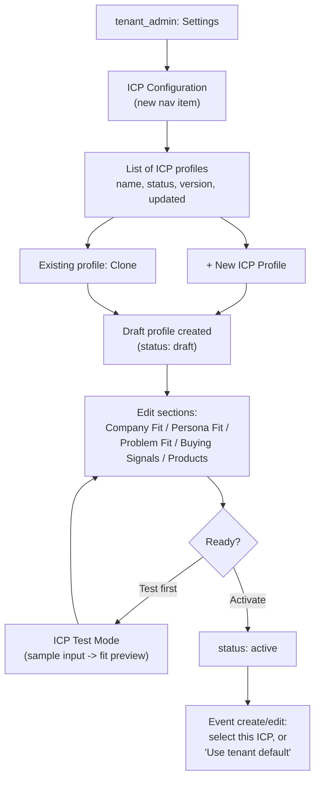

# Release 14.3 — Configurable ICP Administration

**Status: implemented and verified, not yet deployed to production.** Sections A–R below are the original plan as approved. Three amendments were made to that plan before/during implementation (Test Mode role scope, no separate `preview.ts` scoring engine, explicit Default ICP concept replacing "exactly one active = default") — see [Implementation report](#implementation-report-2026-08-21) at the bottom for exactly what was built, how it differs from the original plan, and full test results. The plan text below is preserved as-approved for historical reference; where it's since been superseded, the implementation report is authoritative.

## A. Objective

Let a tenant administrator manage the ICP data that R14.2 already made possible to store, through the product UI instead of direct database access. This is a **configuration and administration layer** on top of existing, already-verified data/resolver code — not a rules engine, not a rewrite of any agent.

## B. Current architecture dependency

Everything R14.3 needs already exists and is verified:
- `icp_profiles` table + `icp_status` enum (`draft`/`active`/`inactive`) — `src/db/schema.ts`
- `events.icp_profile_id` (nullable FK) — `src/db/schema.ts`
- `ICPConfigSchema` (Zod) — `src/lib/icp/schema.ts` — the five-section shape (Company Fit / Persona Fit / Problem Fit / Buying Signals / Products) this UI edits
- Resolver — `src/lib/icp/icp-resolver.ts`: `getICPProfile`, `getActiveICPForEvent`, `getICPConfiguration`, `getICPVersion`, `validateICPConfiguration`, `validateEventICPAssignment`
- Shared fit heuristic — `src/lib/icp/fit.ts` (unrelated to Test Mode's preview calculation — see §J)

R14.3 adds API routes and UI on top; it does not change any of the above.

## C. User roles and permissions

Following the existing pattern for tenant-level configuration (Tenant Settings, Users — see [07-authentication-security.md](07-authentication-security.md), [08-multi-tenant-architecture.md](08-multi-tenant-architecture.md)):

| Action | `platform_admin` | `tenant_admin` | `manager` | `booth_user` |
|---|---|---|---|---|
| View ICP profiles | Own-tenant-targeted only (no cross-tenant browsing UI planned) | ✅ | ✅ (read-only) | ❌ |
| Create / edit / clone / activate / deactivate | ❌ (oversight role, not operational — matches existing pattern) | ✅ | ❌ | ❌ |
| Assign ICP to event | ❌ | ✅ | ❌ (matches: event create/edit is already tenant_admin-only) | ❌ |
| Use ICP Test Mode | ❌ | ✅ | ✅ (read-only elsewhere, but a simulation has no write risk — open question, see §Q) | ❌ |

This mirrors `POST/PATCH /api/events` (`tenant_admin`) and Tenant Settings edits (`tenant_admin`) exactly — no new permission concept introduced.

## D. User journey



## E. UI/pages required

- `src/app/(app)/settings/icp/page.tsx` — list view (name, status badge, version, last updated, quick actions), following `src/app/(app)/settings/tenant/page.tsx`'s existing layout pattern. Reuse `src/components/ui/*` primitives per [14-coding-standards.md](14-coding-standards.md) — no new design system.
- `src/app/(app)/settings/icp/[id]/page.tsx` — edit view, five collapsible/tabbed sections matching `ICPConfigSchema` exactly (Company Fit, Persona Fit, Problem Fit, Buying Signals, Products). Structured form fields (tag-style multi-value inputs for the string-list fields — target industries, titles, keywords, etc.), not raw JSON, per the brief's explicit instruction ("do not expose raw JSON to normal users").
- `src/app/(app)/settings/icp/[id]/test/page.tsx` (or a modal on the edit page — see open question §Q) — Test Mode form + result.
- `src/app/(app)/events/new` / event edit form — add an ICP picker (dropdown: tenant's active profiles + "Use tenant default").

## F. API routes required

All under `src/app/api/icp-profiles/`, following the existing route-handler conventions ([05-api-reference.md](05-api-reference.md), [14-coding-standards.md](14-coding-standards.md)) — `await auth()` first, tenant-scoped, `{ error: string }` on failure, `logAudit()` on mutations:

| Route | Method | Auth | Notes |
|---|---|---|---|
| `/api/icp-profiles` | GET | any (tenant-scoped) | List profiles for `session.user.tenantId` |
| `/api/icp-profiles` | POST | `tenant_admin` | Create (status starts `draft`); validates via `validateICPConfiguration` |
| `/api/icp-profiles/:id` | GET | any (tenant-scoped) | Single profile |
| `/api/icp-profiles/:id` | PATCH | `tenant_admin` | Edit; bumps `version` when `configurationJson` changes (not on name/description-only edits, matching the existing versioning design) |
| `/api/icp-profiles/:id/clone` | POST | `tenant_admin` | Copies `configurationJson` into a new `draft` profile |
| `/api/icp-profiles/:id/activate` | POST | `tenant_admin` | Sets `status: active` |
| `/api/icp-profiles/:id/deactivate` | POST | `tenant_admin` | Sets `status: inactive` |
| `/api/icp-profiles/:id/test` | POST | `tenant_admin`/`manager` (see §Q) | Simulation only — see §J |
| `PATCH /api/events/:id` | PATCH | `tenant_admin` (existing route) | Extended to accept `icpProfileId`, validated via `validateEventICPAssignment()` before persisting |

No `DELETE` route — matches this codebase's general pattern of soft-disable over hard-delete for configuration entities (deactivate, don't destroy — an ICP profile may be referenced by historical `lead_scores`/`events` once R14.5+ lands, so deleting it later would orphan references even though nothing references it yet today).

## G. Database impact

**None beyond what R14.2 already added.** R14.3 is UI/API only — no new migration. (If `icp_profiles.version` bump-on-edit logic needs anything beyond what's already in the table, it doesn't — `version` already exists.)

## H. ICP lifecycle

`draft → active → inactive`, exactly as specified — no additional states.
- New profiles start `draft`.
- `activate` and `deactivate` are the only transitions (no `draft → inactive` direct path needed, but not worth blocking either — simplest to allow any transition via the two explicit endpoints rather than a state machine with disallowed edges, since nothing bad happens either way).
- The resolver's existing "exactly one active profile = implicit default" rule (R14.2, [ICP-ARCHITECTURE.md](ICP-ARCHITECTURE.md)) is **not changed by R14.3** — if a tenant activates two profiles simultaneously, the resolver still returns `null` (no default) rather than guessing, exactly as today. The UI should surface this clearly (e.g., a warning banner: "2 active profiles — no default will be used until only one is active, or every event has an explicit ICP assigned") rather than silently allowing a confusing state. This is a UI clarity improvement, not a resolver change.

## I. Event-level ICP assignment

Per the brief: "one tenant-level active default ICP, with an optional event-level ICP override... never trust a client-supplied ICP ID without tenant validation." Implementation is a thin addition to the existing event create/edit flow:
- Dropdown populated from `GET /api/icp-profiles` (already tenant-scoped).
- On submit, `PATCH /api/events/:id` calls `validateEventICPAssignment(session.user.tenantId, icpProfileId)` before writing `events.icpProfileId` — this function already exists and already throws `ICPTenantMismatchError` on mismatch (R14.2, verified). R14.3 just needs to call it and translate the exception into a 403/400 response.
- No new validation logic needs to be written — this is wiring, not new design.

## J. ICP Test Mode design

**Must be simulation-only** — the brief is explicit: no lead, no Apollo call, no opportunity, no CRM sync job, no follow-up, no ROI effect, no orchestrator trigger.

**Design tension worth flagging explicitly:** producing a "Company Fit / Persona Fit / Problem Fit / Buying Intent" preview requires *some* scoring logic that reads the ICP config and compares it against sample input — but §10 of the brief says not to rewire the real Lead Scoring model in R14.3. Resolution: a **separate, self-contained preview calculator** (proposed: `src/lib/icp/preview.ts`), which:
- Takes the ICP profile's `configurationJson` + a sample payload (company name, industry, country, employee count, job title, notes/conversation text) directly from the test form.
- Computes a *preview-only* fit breakdown by simple keyword/range matching against the ICP config sections (e.g., does sample industry appear in `targetIndustries`; does employee count fall in `[employeeSizeMin, employeeSizeMax]`; do notes contain any `priorityPainPoints` keywords).
- Returns matched/missing/negative criteria and an overall qualitative read, **explicitly labeled as an approximation** ("this previews how your ICP criteria would likely score a lead like this — the real Lead Scoring model isn't wired to ICP configuration until Release 14.5").
- **Does not call** `src/lib/agents/lead-scoring.ts`, Gemini, or Apollo. No DB writes at all (not even an audit log entry, since nothing consequential happened — worth confirming with the user as an explicit choice, see §Q).

This preview calculator is intentionally a **temporary, separate piece of logic** that will likely be superseded (not necessarily deleted, but no longer the only fit-calculation path) once R14.5 wires real ICP context into `lead-scoring.ts`. That's an accepted, explicit tradeoff of sequencing Admin UI before agent integration — flagged here rather than discovered later.

## K. Tenant isolation / security

- Every new route follows the existing enforcement pattern: `tenantId` from `session.user.tenantId`, never from the request body/params, except where `platform_admin`-equivalent cross-tenant behavior is explicitly needed (not needed anywhere in R14.3 — `platform_admin` has no ICP management role per §C).
- `validateEventICPAssignment()` (already built, already tested) is the enforcement point for the one place a client-supplied ID (`icpProfileId` on an event) reaches the server — reused, not reimplemented.
- Test Mode accepts no persistent IDs from the client beyond the ICP profile being tested, which is itself tenant-validated via the existing `getICPProfile()` tenant-scoped lookup.
- No new attack surface class — this is "one more tenant-scoped CRUD resource," the same shape as every other admin resource in this codebase.

## L. Backward compatibility

No existing behavior changes for any tenant that doesn't touch this UI. Tenants who never create an ICP profile continue exactly as today (R14.2's `null`-context fallback, unchanged). Existing events with `icpProfileId: null` are unaffected — the dropdown just shows "Use tenant default" as the current selection.

## M. Validation strategy

Matches this codebase's actual testing practice — no automated test suite exists here ([15-testing-guide.md](15-testing-guide.md)), so:
1. `npm run build` clean (baseline, as always).
2. Manual click-through: create a draft profile, fill each of the 5 sections, save, reload, confirm persistence; clone; activate; deactivate; assign to an event; confirm cross-tenant assignment is rejected (log in as a different tenant, confirm the profile doesn't appear and a forged ID is rejected).
3. Regression check: confirm a tenant with **no** ICP profile still sees identical Lead Scoring/Company Intel behavior to before R14.3 (same check R14.2 already did — re-run it, since nothing about the resolver changes, but worth confirming the UI doesn't accidentally force ICP creation).
4. Test Mode: confirm no `leads`/`lead_scores`/`crm_sync_jobs`/`opportunities`/`followup_recommendations` row is created by exercising it, by checking row counts before/after.

## N. Files expected to change

**New:**
- `src/app/api/icp-profiles/route.ts`, `[id]/route.ts`, `[id]/clone/route.ts`, `[id]/activate/route.ts`, `[id]/deactivate/route.ts`, `[id]/test/route.ts`
- `src/app/(app)/settings/icp/page.tsx`, `[id]/page.tsx`, supporting client components (list table, section forms, Test Mode form/result)
- `src/lib/icp/preview.ts` (Test Mode's standalone calculator, per §J)
- `src/lib/nav.ts` — add "ICP Configuration" under Settings, `tenant_admin`-gated

**Modified:**
- `src/app/api/events/route.ts` and/or `[id]/route.ts` — accept + validate `icpProfileId`
- Event create/edit UI — add the ICP picker
- `docs/05-api-reference.md`, `docs/13-folder-structure.md` — document the new routes/pages (documentation-in-the-same-PR, per [14-coding-standards.md](14-coding-standards.md))

**Not touched:** `src/lib/agents/*` (all six/eight agents), `src/lib/orchestrator/*`, `src/lib/ai/provider.ts` — confirms §10's boundary is achievable without touching integration code.

## O. Risks

| Risk | Severity | Mitigation |
|---|---|---|
| Test Mode's preview calculator (§J) diverges from the real Lead Scoring model once R14.5 lands, confusing users who compare the two | Medium | Explicit "approximation" labeling in the UI now; R14.5 should either replace this calculator with the real one or clearly reconcile the two — flag as an R14.5 planning input |
| Multi-active-profile ambiguity (resolver returns `null`) is confusing without clear UI messaging | Low-Medium | Explicit warning banner when >1 profile is active (§H) |
| Structured form for 5 sections × many string-list fields is a lot of UI surface for one release | Medium | Build one section's form component generically (label + tag-input + description) and reuse it 5×, rather than 5 bespoke forms — keeps this from ballooning |
| Someone treats `icp_profiles.version` bump-on-edit as a full audit history when it isn't | Low | Document clearly: version is a number, not a stored diff; full historical version snapshots are out of scope (matches R14.2's explicit "no complex historical version management yet") |

## P. Implementation sequence

1. API routes (F) — CRUD + lifecycle actions, tenant-scoped, tested via direct API calls before any UI exists (matches how R14.2 itself was verified).
2. List + edit UI (E) — one section's form component built generically, reused across all 5 sections.
3. Event ICP assignment (I) — smallest piece, mostly wiring.
4. Test Mode (J) — last, since it's the most novel piece (new preview-calculation logic) and benefits from the rest being stable first.
5. Manual validation pass (M).
6. Documentation updates (N).

## Q. Acceptance criteria

- A `tenant_admin` can create, edit (all 5 sections), clone, activate, and deactivate an ICP profile through the UI with no raw JSON exposed.
- An event can be assigned an explicit ICP or left on "tenant default," validated server-side against tenant ownership.
- ICP Test Mode returns a fit preview for sample input and provably creates zero rows in `leads`, `lead_scores`, `crm_sync_jobs`, `opportunities`, or `followup_recommendations`.
- A tenant with zero ICP profiles sees no behavior change anywhere in the product.
- `npm run build` clean; manual validation pass (M) complete.

**Open questions for the user before implementation starts:**
1. Should `manager` have access to ICP Test Mode (read-only exploration), or `tenant_admin`-only like everything else ICP-related? (§C marks this as open.)
2. Should Test Mode invocations be audit-logged even though nothing consequential happens, for usage-visibility purposes (e.g., "who's been testing this ICP")? Leaning no (simulations aren't the kind of thing this codebase's `audit_logs` currently tracks — it's security/identity-action-focused), but worth confirming.
3. Confirm the preview-calculator tradeoff in §J is acceptable, given it's inherently a temporary duplication that R14.5 will need to reconcile.

## R. Recommendation

**READY**, pending answers to the three open questions above (none are blocking — reasonable defaults are stated for each, and none require re-architecting anything). Complexity/dependency estimate: **Medium** — no new architectural concepts (every piece reuses an existing pattern from this codebase: tenant-scoped CRUD API, Settings-page UI, form validation via Zod), but real UI surface area (5 config sections × structured multi-value fields + list/edit/test pages). The largest single risk is §O's first item (Test Mode/real-scoring divergence), not implementation difficulty.

---

## STOP GATE

Per the brief: do not commit R14.2 changes further, push, apply `0016_icp_profiles.sql` to production, deploy R14.2, start R14.3 coding, or change production configuration until explicitly approved.

**R14.2 verification: PASS**
**R14.3 plan: READY**
**Production changes made: NONE**
**Awaiting user approval: YES**

---

## Implementation report (2026-08-21)

**R14.3 status: code-complete, tested, committed. Not deployed. R14.4 not started.**

### Amendments applied vs. the plan above

The plan above (§C, §J, §H) was amended before/during implementation per explicit user approval:

1. **Test Mode is `tenant_admin`-only**, not `tenant_admin`/`manager` as §C/§Q left open — closing open question 1 in favor of the narrower default.
2. **No `src/lib/icp/preview.ts`.** §J's "separate preview calculator" proposal was rejected in favor of extending the *existing* `src/lib/icp/fit.ts` with a new pure qualitative function (`evaluateICPFitQualitative`). Same non-goal (no numeric score, no coupling to real Lead Scoring), different file organization — one shared ICP-fit module instead of two. §O's first risk (divergence between preview and real scoring) is reduced by this, since there's now only one file to reconcile in R14.5, not two.
3. **Test Mode is not audit-logged** — closes open question 2 in the plan, decided as "no."
4. **Explicit Default ICP**, not §H's "exactly one active profile = implicit default." Before implementation, the existing `tenants` schema was inspected; the smallest safe addition was one nullable FK column, `tenants.default_icp_profile_id` (migration `0017`, additive-only, `ON DELETE SET NULL`). A tenant may now have multiple simultaneously-active ICP profiles (§H's original ambiguity is gone — activating two profiles is no longer a confusing no-default state, it's normal); exactly one may additionally be marked the tenant Default via `PATCH /api/icp-profiles/default` (`tenant_admin`-only, tenant-ownership-validated server-side). `deactivateICPProfile()` clears the default pointer if the deactivated profile was it, so the resolver never serves a stale default. Full resolution order documented in [ICP-ARCHITECTURE.md](ICP-ARCHITECTURE.md#resolution-order-getactiveicpforevent--updated-in-release-143).

Everything else in the plan (§B roles for CRUD, §D journey, §E page structure, §F route list, §I event-assignment wiring, §K isolation model, §L backward compatibility, §N file list) was implemented as originally planned.

### Exact files changed

**New:**
- `drizzle/0017_icp_default_profile.sql`
- `src/app/api/icp-profiles/route.ts`, `[id]/route.ts`, `[id]/clone/route.ts`, `[id]/activate/route.ts`, `[id]/deactivate/route.ts`, `[id]/test/route.ts`, `default/route.ts`
- `src/app/(app)/settings/icp/page.tsx`, `ICPListClient.tsx`, `[id]/page.tsx`, `[id]/ICPEditClient.tsx`
- `src/components/icp/TagListField.tsx`

**Modified:**
- `src/db/schema.ts` — `tenants.defaultIcpProfileId`
- `src/lib/icp/icp-resolver.ts` — new Default ICP resolution order; new `assertICPProfileOwnedByTenant`, `setTenantDefaultICP`, `deactivateICPProfile`
- `src/lib/icp/fit.ts` — added `evaluateICPFitQualitative` and its supporting types
- `src/app/api/events/route.ts`, `src/app/api/events/[id]/route.ts` — server-side-validated `icpProfileId` accept/change on create and edit, dedicated `event_icp_assigned` audit entry
- `src/app/(app)/events/EventsClient.tsx` — ICP picker on event creation
- `src/lib/nav.ts` — "ICP Configuration" nav item (`tenant_admin`-only); `CURRENT_RELEASE` bumped `13 → 14.3` (required for the nav item to render unlocked)
- `docs/ICP-ARCHITECTURE.md` — full rewrite covering R14.3

### Database impact

Additive only. `drizzle/0017_icp_default_profile.sql`:
```sql
ALTER TABLE tenants
  ADD COLUMN default_icp_profile_id UUID REFERENCES icp_profiles(id) ON DELETE SET NULL;
CREATE INDEX tenants_default_icp_profile_idx ON tenants (default_icp_profile_id);
```
No existing row modified. Verified applying cleanly after migrations `0001`–`0016` in a fresh isolated Docker Postgres instance. **Not applied to production** — bundled with `0016` in the same still-pending production migration plan (see [ICP-ARCHITECTURE.md](ICP-ARCHITECTURE.md#production-migration-plan)).

### Tenant-isolation results

4/4 checks passed, both via isolated-database script and live browser session:
1. `assertICPProfileOwnedByTenant()` rejects a cross-tenant profile ID (used by both event assignment and default assignment) — confirmed throws `ICPTenantMismatchError`.
2. All `/api/icp-profiles/*` CRUD/lifecycle routes and `/api/icp-profiles/default` require `session.user.role === "tenant_admin"` exactly (not `platform_admin`) and scope every query to `session.user.tenantId`.
3. `POST /api/events` and `PATCH /api/events/:id` — previously a blind body spread on `PATCH` would have let an unvalidated `icpProfileId` through; both routes now explicitly extract, compare-for-change, and validate `icpProfileId` via `validateEventICPAssignment()` before it reaches the database.
4. A tenant with zero ICP profiles and no default set resolves identically to pre-R14.3 behavior (`getActiveICPForEvent` → `null`) — re-verified after the resolver rewrite.

### Test Mode side-effect verification

Verified live (real API, real UI, real database), not just by code inspection:
- **No numeric score in the response** — qualitative criteria only (matched/missing/negative/unknown), confirmed against the actual `POST /api/icp-profiles/:id/test` response shape.
- **Zero audit_logs rows** from Test Mode invocations, while the same test session's create/edit/activate/set-default actions each logged exactly one row — confirmed via direct SQL query before/after.
- **Zero rows created** in `leads`, `lead_scores`, `crm_sync_jobs`, `opportunities`, `followup_recommendations` — confirmed via row-count checks before/after a live Test Mode run.
- **No external calls** — `evaluateICPFitQualitative()` is a pure function (no DB access, no fetch); the route performs one read (the profile being tested) and zero writes.

### Build result

`npm run build` from the main project folder: **clean, exit 0, zero errors.** All 9 new routes/pages present: `/api/icp-profiles`, `/api/icp-profiles/[id]`, `.../activate`, `.../clone`, `.../deactivate`, `.../test`, `/api/icp-profiles/default`, `/settings/icp`, `/settings/icp/[id]`.

### Recommendation for R14.4

**PROCEED**, with one input for R14.4 planning specifically: R14.4 is Conversation Intelligence ICP-awareness — the first release where an agent actually reads a resolved `ICPContext` rather than the fixed hardcoded default in `fit.ts`. Since R14.3 made `getActiveICPForEvent()` the single already-tested resolution entry point (event override → tenant default → null), R14.4 should call that function directly rather than re-deriving ICP context — it's already tenant-isolated, already handles the "no ICP configured" `null` case that every tenant is in today, and already accounts for a deactivated default. No other blocking concerns.

**Production deployment: NOT performed.** **R14.4: NOT started.** Per the amendment's explicit stop-gate, both remain pending separate user approval.
