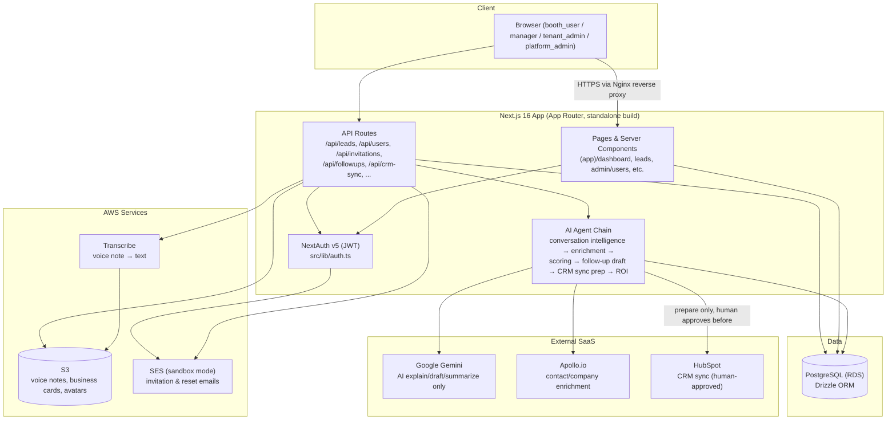
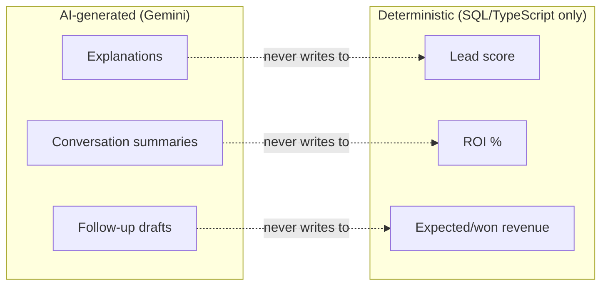
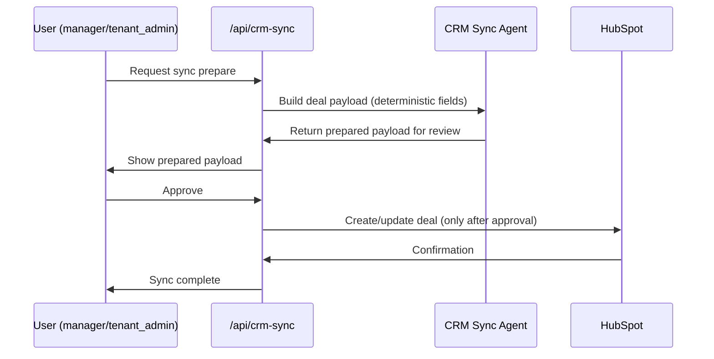

# System Architecture Diagram

Companion to `docs/02-system-architecture.md` (prose) — this is the visual summary.

## High-level component view

## Deterministic vs AI boundary

A guardrail baked into the architecture, not just policy — worth diagramming explicitly since it's easy to violate accidentally when adding new agent code:

## Request flow — CRM sync (human-in-the-loop, never automatic)

