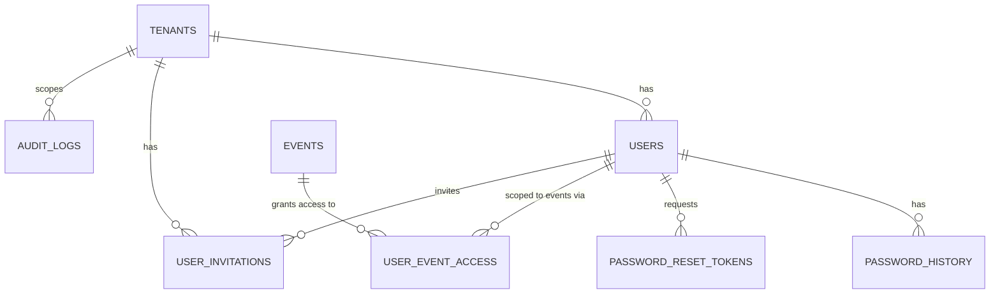
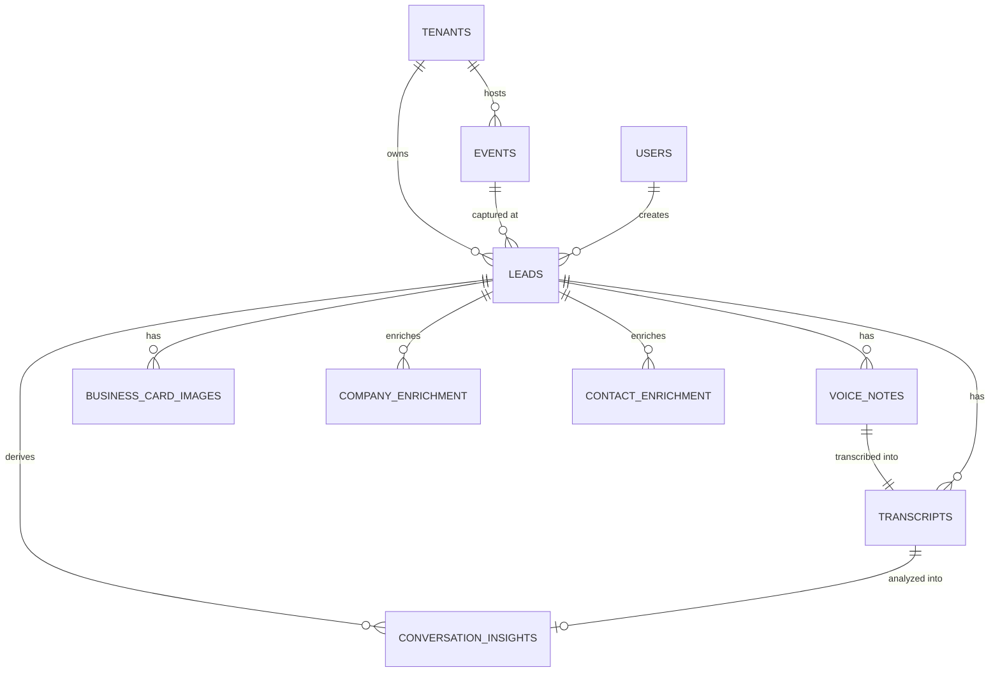
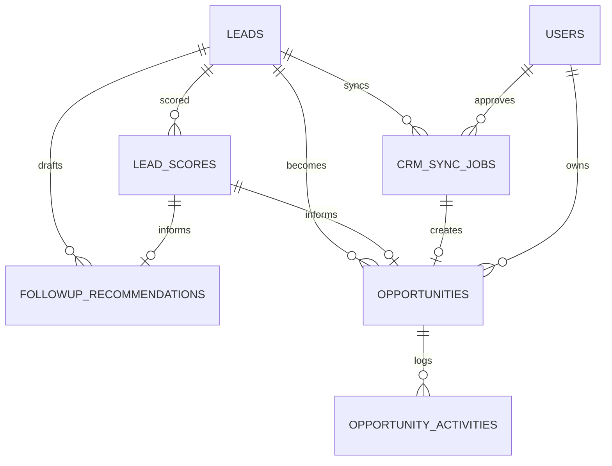
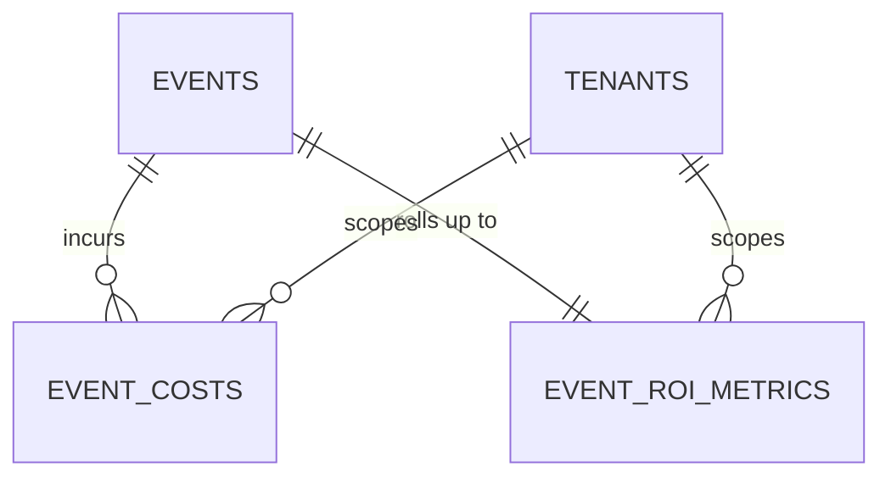
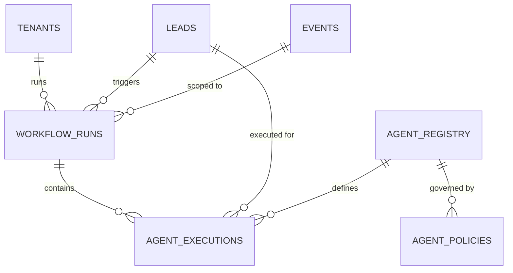

# Database ERD

Generated from `src/db/schema.ts` (26 tables). Grouped by domain for readability — see `docs/04-database-schema.md` for column-level detail; this is relationships only.

## Core tenancy & identity

## Lead capture & enrichment pipeline

## Scoring, follow-up, CRM sync, opportunities (revenue chain)

## ROI attribution

## Agent orchestration (Release 13)

## Cross-cutting

- Every business table carries a `tenantId` foreign key (`onDelete: cascade`) — see `docs/08-multi-tenant-architecture.md` for how this is enforced at the query layer, not just the schema layer.
- `createdByUserId` (or equivalent, e.g. `ownerUserId`, `approvedByUserId`) appears on most operational tables with `onDelete: set null` — deleting a user does not cascade-delete their historical work, it just orphans the foreign key.
- `audit_logs` references both `tenants` and `users` with `onDelete: set null` and is append-only (see `docs/07-authentication-security.md`).
