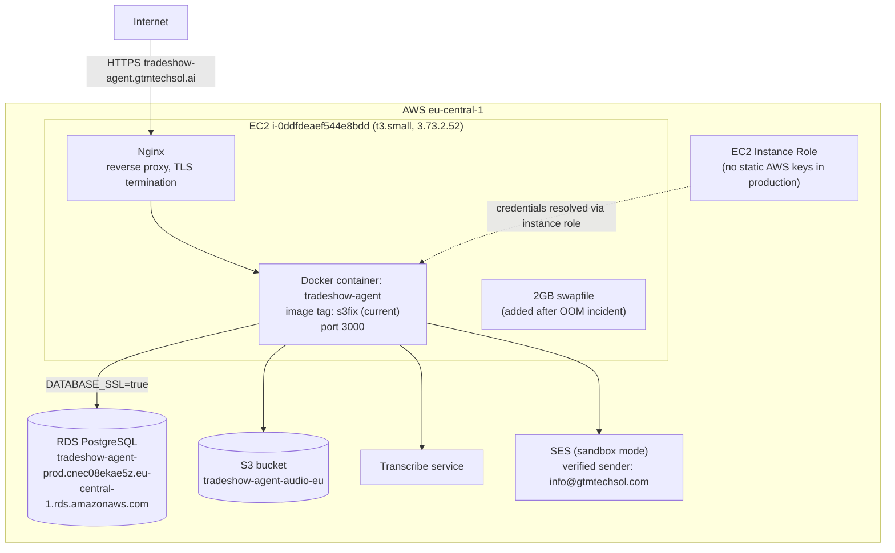
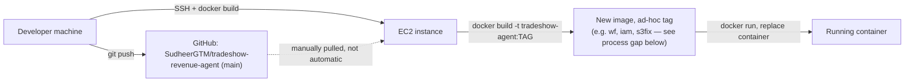
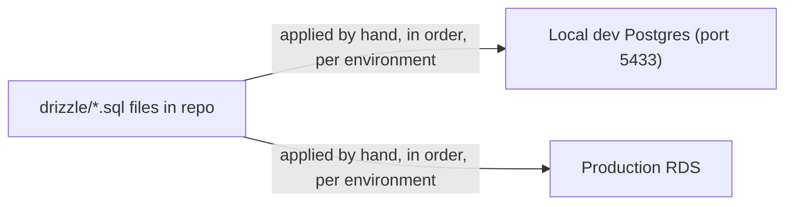

# Deployment Diagram

Reflects the actual running infrastructure as verified in `docs/production-gap-analysis.md` (2026-06-27 inspection) — not assumed from docs alone.

## Infrastructure topology

## Deploy flow (manual, no CI/CD pipeline)

**Known process gap (see `docs/production-gap-analysis.md`):** image tags are ad-hoc labels (`wf`, `iam`, `qc`, `s3fix`, etc.) with no link back to the git commit they were built from. Recommended fix: tag images with the git short-SHA at build time so "what's actually running" can be answered without SSHing in and grepping compiled bundles.

## Database migrations (manual, no runner)

No automated migration runner exists yet — see `docs/16-troubleshooting.md` known issue #2 and the migration strategy doc for the recommended path forward.

## Host resource notes

- t3.small = 2GB RAM. Swapfile (2GB) was added specifically because `next build` inside the EC2 instance OOM'd without it.
- Multiple old/unused Docker images accumulate on the host (`wf`, `iam`, `qc`, `qc2`, `latest`, dangling `<none>` images) — disk usage not currently monitored; recommend periodic `docker image prune`.
